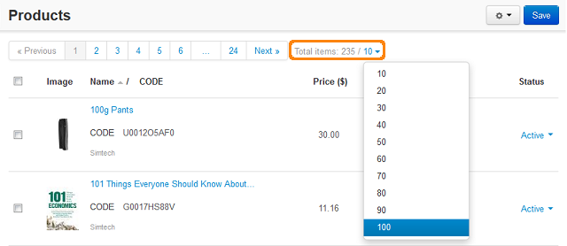
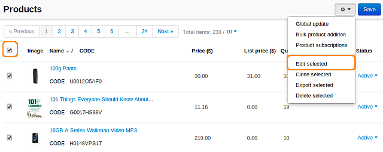

***********************************************
How To: Enable Reviews for All Products at Once
***********************************************

To enable reviews for all products at once:

*   In the Administration panel, go to **Products > Products**.
*   In the **Total items** option select *100*.

*   Select the left top check box to select all products.
*   After that click the gear button and select **Edit selected**. 

*   In the opened window click the **Unselect all** link.
*   Tick the **Reviews** check box and click **Modify selected**.
*   On the new page click the **Apply values to all selected products** link.
*   In the appeared section tick the **Reviews** check box and select *Communication* (*Rating* or *All*) in the select box.
*   Click **Apply**. The selected value will be applied to all the products.

.. image:: img/reviews_03.png
	:align: center
	:alt: Update products

*   Repeat these points if needed for other products.