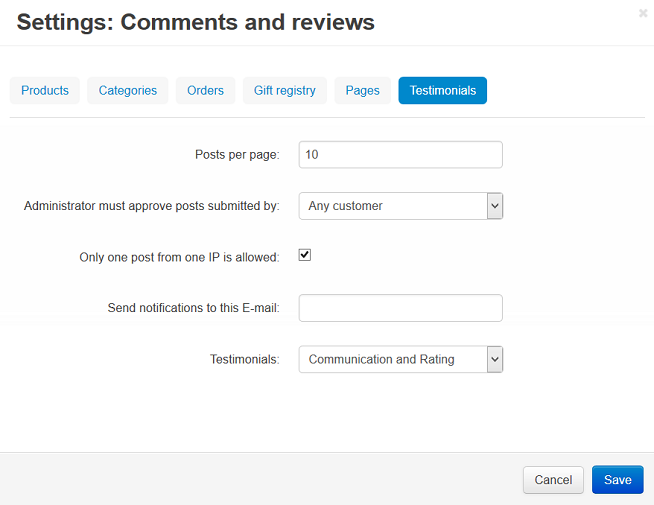
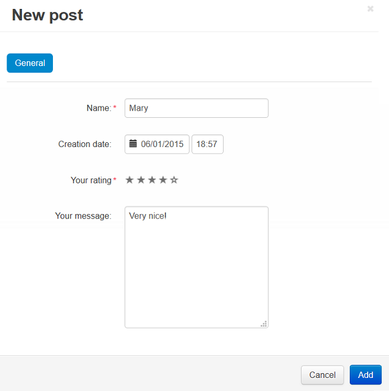

************************************
How To: Create and Edit Testimonials
************************************

To set up testimonials:

*   In the Administration panel, go to **Add-ons > Manage add-ons**.
*   Click on the name of the **Comments and reviews** add-on and open the **Testimonials** tab.
*	Configure the :doc:`settings <../comments_and_reviews/comments_settings>`.
*   Click **Save**.

To create testimonials:

*   Go to **Website > Testimonials**.
*   Click the **+** button.
*   In the **Name** input field type the name of the user to whom the testimonial belongs, in the **Your rating** option select the desired value, in the **Your message** text field type the testimonial.
*   Click the **Add** button.

To edit testimonials:

*	Go to **Website > Testimonials**.
*   Edit the desired testimonials and click **Save**.
