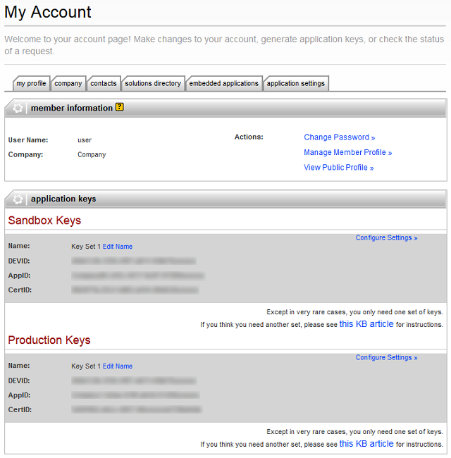

*********************************************************
How To: Install and Configure eBay Synchronization Add-On
*********************************************************

.. note::

    **Tutorial Difficulty: 2 / 3**
			
Install and configure the **eBay synchronization** add-on in 3 steps.

===========================================
Step 1. Install eBay Synchronization Add-On
===========================================

1.1. In the CS-Cart administration panel go to **Add-ons → Manage Add-ons**.

1.2. Switch to the **Browse all available add-ons tab**, find the **eBay synchronization** add-on in the list, and click the **Install** button.

1.3. Go back to the **Installed add-ons** tab. Find and click on **eBay synchronization** add-on to see the settings.

1.4. Switch to the **License info** tab in the add-on settings and type your eBay add-on license number in the **eBay add-on license number** field.

.. image:: img/install/license_number.png
    :align: center
    :alt: Enter the license number of eBay synchronization add-on.

.. note::

    You can purchase an eBay add-on license on the `eBay Synchronization page <http://www.cs-cart.com/ebay-synchronization.html>`_.

1.5. Click the **Save** button.

==================================
Step 2. Get the Authorization Keys
==================================

To properly configure the **eBay synchronization** add-on, get the authorization keys at the `eBay Developers Program website <https://developer.ebay.com/>`_.

2.1. `Register at the eBay Developers Program website <https://developer.ebay.com/join/>`_.

2.2. You should receive an Account Activation email with the link to the Account Activation page. Find and click **Get your application keys**.

.. image:: img/install/account_activation.png
    :align: center
    :alt: The link in your activation email will take you to the Account Activation page.

2.3. On the **My Account** page, find the **Application Keys** block. Generate two key sets:

*  **Sandbox Keys**—keys for the test API requests
*  **Production Keys**—keys for real API requests (for the live store)

.. hint::

    You can generate application keys any time on the **My Account** page.

The application keys are unique identifiers that tell eBay which developer and application is making a call. You can generate either one key set (Sandbox or Production), or both.

2.4. Click **Generate Sandbox keys** or **Generate Production** keys depending on your purposes. The system will generate the following keys: **DEVID**, **AppID**, and **CertID**.

2.5. Return to the eBay synchronization settings in your store’s admin panel. Go to **Add-ons → Manage Add-ons**, switch to the **Installed add-ons** tab, and click on the **eBay synchronization** add-on.

2.6. Enter the **eBay DevID**, **eBay AppID**, and **eBay CertID** from Step 2.4. into the corresponding fields.

.. image:: img/install/ebay_settings.png
    :align: center
    :alt: Enter your eBay IDs in the corresponding fields of the add-on settings.

=============================
Step 3. Generate a User Token
=============================

3.1. Go to `https://developer.ebay.com/DevZone/account/tokens/ <https://developer.ebay.com/DevZone/account/tokens/>`_.

3.2. Choose the key set and the environment. Use **Sandbox environment** for testing and **Production environment** for actual sales.  After you specify the key set and environment, click **Continue to generate token**.

.. image:: img/install/generate_token.png
    :align: center
    :alt: Gene.

3.3. You need to link a token to your eBay user account. Click the **Register** button on the right side of the page to create a new eBay user account. If you already have an account, enter the credentials and press **Sign in**.

.. important::

    The eBay user account **IS NOT** the developer account that you registered in Step 2.1.

.. image:: img/install/ebay_sign_in.png
    :align: center
    :alt: Sign in with your eBay user account.

3.4. After creating a user, return to the token generation page, click **Continue to generate token**, and sign in with the credentials of your eBay user account.

3.5. Read the note and click **I agree** on the opened window. You will proceed to the **Token Generation - Final Step** section.

3.6. Copy the code displayed in the **Token** field to clipboard.

3.7. Return to the eBay synchronization settings in your store’s admin panel. Go to **Add-ons → Manage Add-ons**, switch to the **Installed add-ons** tab, and click on the **eBay synchronization** add-on.

3.8. Paste your token from the clipboard to the **eBay User Token** field.

3.9. Choose the environment in the **Sandbox/Production** field. Use **Sandbox for testing** and **Production for the live store**.

3.10. Click the **Save** button.
