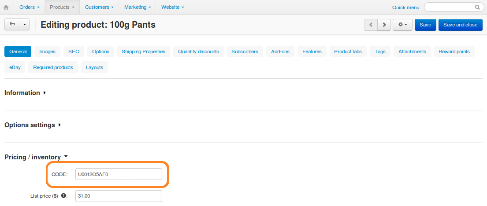

********************************************
How To: Specify Product Identifiers for eBay
********************************************

.. note::

    **Tutorial Difficulty: 1 / 3**

    The eBay Synchronization add-on didn't support product identifiers until CS-Cart & Multi-Vendor 4.3.7. This article doesn't apply to earlier versions.

Items can't be listed `in certain categories <http://pages.ebay.com/sell/item_specifics/product_identifiers.html>`_ on eBay, unless you specify product identifiers, such as Brand, UPC, EAN, ISBN, or MPN. For more information, check the dedicated `eBay FAQ <http://pages.ebay.com/sellerinformation/news/springupdate2015/product-identifiers.html>`_.

.. image:: img/identifiers/product_features.png
    :align: center
    :alt: Any feature of the product can serve as a product identifier.

=================================
Step 1. Enter Product Identifiers
=================================

------------
For Products
------------

You can use :doc:`features <../../manage_products/features/index>` as product identifiers. After you :doc:`install eBay Synchronization <ebay_install>`, go to **Products → Features**. You'll see that a new feature group has been added automatically for your convenience. 

.. warning::

    These features will be deleted if you uninstall the add-on.

.. image:: img/identifiers/identifier_features.png
    :align: center
    :alt: eBay Synchronization adds product identifiers as features, when installed.

To specify eBay product identifiers for a product, follow these steps:

1. Go to **Products → Products** and click the name of the desired product. 

2. Switch to the **Features** tab.

3. Fill in the fields of the features you'd like to use as product identifiers.

.. note:: 

    You don't have to use the features added by the add-on.
  
You can also use the **CODE** field of the product, if it corresponds to one of the product identifiers required by eBay.

4. Click **Save**.

.. hint::

    You can edit the features of the products in bulk the same way as you :doc:`edit other eBay parameters <ebay_bulk_edit>`.

-------------------------------
For Product Option Combinations
-------------------------------

.. important::

    If you want to export :doc:`product options <../../manage_products/features/index>`, group them under **Option Combinations**.

Option combinations support only one field for product identifiers. That field is **CODE**. It can serve as either UPC, EAN, or ISBN of the option combination:

1. Go to **Products → Products** and click the name of the desired product.

2. Switch to the **Options** tab and click **Option combinations**.

3. Edit the **CODE** field of the combinations.

4. Click **Save**.

.. note::

    The type of the product identifier that the **CODE** field stands for is determined by the eBay template in **Step 2**. 

.. image:: img/identifiers/ebay_combination_code.png
    :align: center
    :alt: You can use the CODE of the product as one of the product identifiers for eBay.

====================================
Step 2. Configure Your eBay Template
====================================

.. hint::

     :doc:`Learn more about eBay templates. <ebay_templates>`

:doc:`Adding your own feature and calling it Brand <../../manage_products/features/manufacturer>` won't be enough for eBay to treat that feature as a product identifier. Even if you use the features added by the add-on, you'll need to follow the instructions below before you attempt to :doc:`export your products <export_to_ebay>`:

1. Go to **Marketing → eBay → eBay templates**.

2. Create a new eBay template or open an existing one.

3. Switch to the **Product identifiers** tab.

4. Select the features that correspond to eBay product identifiers. You can also use the **CODE** field.

.. note::

    If your eBay template exports products to a `category that requires product identifiers <http://pages.ebay.com/sell/item_specifics/product_identifiers.html>`_, don't leave *None* for those identifiers, or the export will result in an error. If you want to export products that don't have product identifiers for some reason (e.g., an old book that doesn't have ISBN), choose *Does not apply*.

5. If you edit an existing eBay template, click **Save**.

This will make your eBay template export the specified features and CODE fields as product identifiers.

.. image:: img/identifiers/template_identifiers.png
    :align: center
    :alt: eBay Synchronization adds product identifiers as features, when installed.
