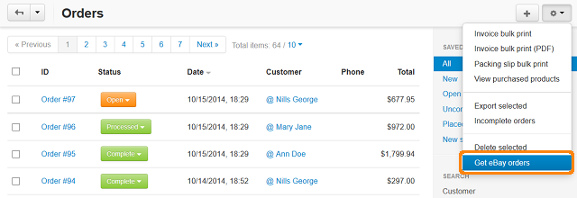

****************************************
How To: Import Complete Orders from eBay
****************************************

.. note::

    **Tutorial Difficulty: 1 / 3**

1. In the administration panel go to **Orders → View orders**

2. Click the **gear button** in the right upper corner of the page 

3. Choose **Get eBay orders** to import orders from eBay to your store

.. note::
 
    This will only import orders that contain products exported from CS-Cart. The imported orders will have the **Processed** status.

