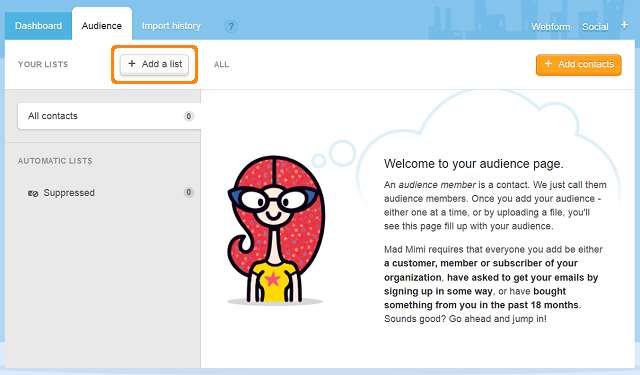

******************************************
How To: Export Your Subscribers to MadMimi
******************************************

The **Email marketing** add-on allows to export subscribers from the CS-Cart store to your account on `MadMimi <https://madmimi.com/>`_.

To start export:

*   First of all you should log-in into your **MadMimi** `administration panel <https://madmimi.com/session/new>`_. If you have no account on MadMimi, `create it <https://madmimi.com/service_agreements/signup?id=48>`_.
*   If you have no lists on MadMimi yet, go to the **Audience** tab and click the **Add a list** button to create one.

*   To connect your store to MadMimi, in the upper panel choose **Account** and in the right part of the opened page find the **Settings & Billing** section.
*   In this section choose the **API** tab and copy the **Secret API key**.

.. image:: img/madmimi_02.png
	:align: center
	:alt: API key

*   After that, log in to your **CS-Cart** administration panel and go to **Add-ons > Manage Add-ons**.
*   Activate the **Email marketing** add-on and open its settings.
*   In the **General** tab choose **MadMimi** in the **Integration provider** field and choose other prefernces:

    *   **Newsletter checkbox on checkout** - Allow users to subscribe for newsletters on checkout.
    *   **Double opt-in** - If enabled, when subscribing a user will receive a letter suggesting to confirm subscription.
    *   **Send a welcome letter with the unsubscribe link** - The user will receive a letter to the specified email that will contain the unsubscribe link. Using this link he/she will be be able to refuse receiving newsletters.

*   Open the **MadMimi** tab, enter your **E-mail** specified at MadMimi and **API Key** and click **Save**.
*   Choose the desired list from MadMimi in the **List** section.

.. image:: img/madmimi_03.png
	:align: center
	:alt: Email marketing

*   Save your changes.

Now all the subscribers in CS-Cart will be synchronized with your account on MadMimi. All new subscribers will be authomatically added to the selected list in the MadMimi administration panel.

