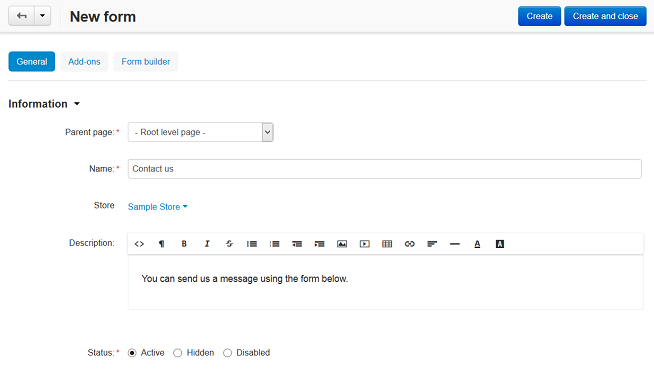
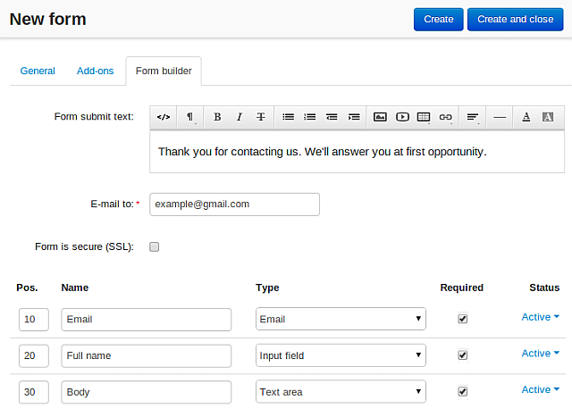

****************************
How To: Create a Custom Form
****************************

*   In the Administration panel, go to **Add-ons → Manage add-ons**.
*   Make sure the **Form Builder** add-on has an *Active* status.
*   Go to **Website → Pages**.
*   Click the **+** button and choose **Add form**.
*   In the **Parent page** drop-down menu choose the parent page for the form.
*   In the **Name** input field type the name of the form (e.g., *Contact us*).
*   Speify other fields, if necessary.

*   Open the **Form builder** tab.
*   In the **Form submit text** input field type a text which customers will see after submitting the form.
*   In the the **E-mail to** field type the e-mail address where the notifications will be sent to.
*   Add fields for your form.

.. note ::

	In order to add a field for the file uploading, select the *File* option in the **Type** select box.
	In addition to the **Standard** fields (Select box, Text area, Radio group, etc.) you can also add **Special fields**: Date, E-mail, Number, Phone, etc.

*   Click **Create and close**.

