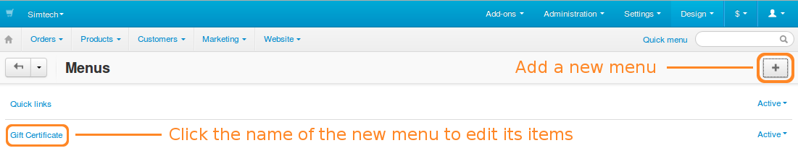
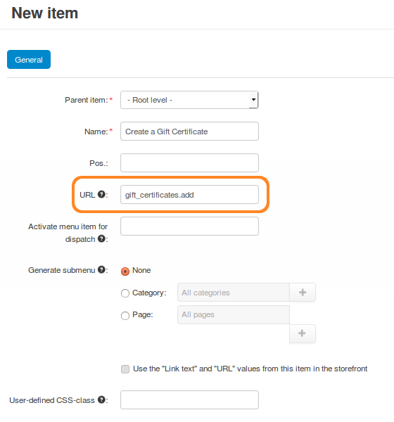
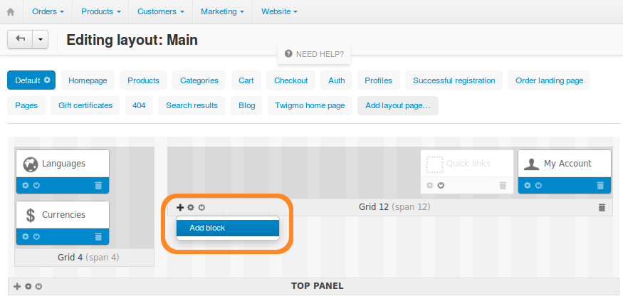
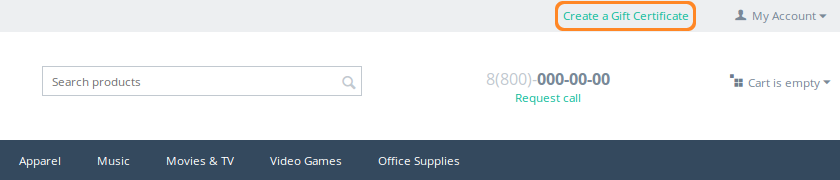

************************************************************
How To: Enable Customers to Create and Buy Gift Certificates
************************************************************

.. important::

    Before you proceed, go to **Add-ons → Manage add-ons** and make sure the **Gift Certificate** add-on is installed and enabled.

The **Gift Certificate** add-on provides a special page, where customers can create gift certificates, add them to cart, and buy them like any other product.

.. image:: img/buy_gift_certificate.png
    :align: center
    :alt: A gift certificate can include free products, a certain amount of money, or both.

The link to this page doesn’t appear in your store automatically—you’ll have to create a menu element for it manually.

.. note::

    Enter ``example.com/index.php?dispatch=gift_certificates.add`` in the address bar of your browser to access the gift certificate creation page. Replace *example.com* with the domain name of your store. Customers can also use this URL.

=====================
Step 1. Create a Menu
=====================

1.1. Open the Administration panel of your store and go to **Design → Menus**.

1.2. Click the **+** button to add a new menu.

1.3. A pop-up will appear. Specify the menu’s name (for example, *Gift Certificate*) and set the status to *Active*, then click **Create**. You’ll be able to see the new menu on the list.

1.4. Let’s add a new item to the menu. Click the menu’s name and then click the **+** button on the page that opens.

1.5. Configure the menu item in the appearing pop-up:

     * Enter the name of the menu item as it will appear on the storefront. 

     * Enter ``gift_certificates.add`` in the URL field.

     * Specify any other settings you need, then click **Create**.

===================================
Step 2. Display the Menu in a Block
===================================

For your new menu to appear on the storefront, you need to put it into a block.

2.1. Open the Administration panel of your store and go to **Design → Layouts**.

2.2. Find the place where you want the menu to appear. For example, let’s put our menu on the *Default* layout in the *Top Panel* container.

2.3. Use the **+** button and click **Add block** to add the block of the menu to an existing grid.

.. hint::

    You can also create a new grid for a block by using the **+** buttons of one of the 4 containers: *Top Panel*, *Header*, *Content*, and *Footer*.

2.4. A pop-up will appear. Switch to the **Create New Block** tab and click **Menu**.

.. image:: img/block_type.png
    :align: center
    :alt: Select the Menu block type for your new block.

2.5. On the new pop-up, configure the block by filling in the data on the following tabs:

     * **General**—specify the name of the block (*Gifts*, for example) and the type of the menu (*Text links*)

     * **Content**—select the menu to display in the block (*Gift Certificate* in our case)

2.6. Click **Create**. The new block should appear on the grid, and the menu should now be visible to customers.

2.7. You can also customize the look of your new menu. Click the **gear** button (**Block options**) of the newly-created block. Now you can select a wrapper and specify a CSS class for the block.

.. note::

    In this example we used the ``top-quick-links`` class of the Responsive theme.

.. image:: img/custom_css.png
    :align: center
    :alt: Use wrappers and user-defined CSS classes to change the look of the menu.

2.8. Congratulations! Now your customers can reach the gift certificate creation page by using the new menu.

