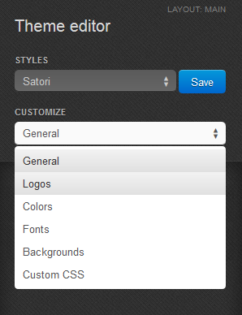
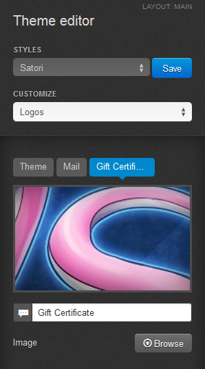

******************************************
How To: Replace Logo in a Gift Certificate
******************************************

To replace CS-Cart logo with your own one in a gift certificate:

*   In the Administration panel, go to **Design > Themes**.
*   Find the layout for the currently used theme and click the **Visual editor** button near it.

.. image:: img/gift_logo_01.png
	:align: center
	:alt: The Themes section

*   On the left panel of the opened page find the **Customize** field and choose **Logos** from the drop-down menu.

*   Choose the **Gift certificate** tab.
*   Click the **Browse** button to upload the logo image and type the alternative text for the image.

*   Click **Save**.

.. important ::

	You cannot change gift certigicate logos for the default style. Create a new one first. To do it, click the **Save** button near the style name and type your new style name in a pop-up window.