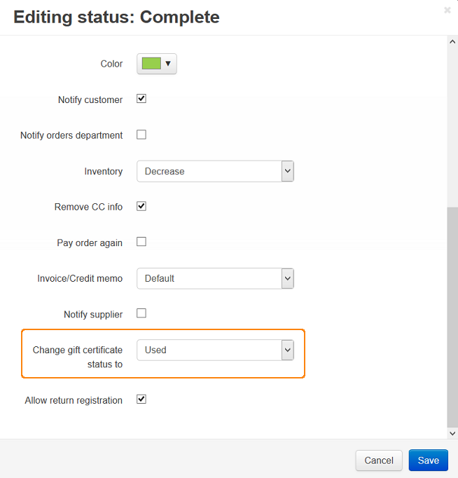

****************************************
How To: Set the Gift Certificates Add-on
****************************************

*   In the Administration panel, go to **Add-ons → Manage add-ons**.
*   Make sure the **Gift certificates** add-on has an *Active* status.
*   Click on the name of the add-on.
*   Set up the desired :doc:`options <../gift_certificates/gc_addon_settings>`.
*   Click **Save**.

.. image:: img/gift_c_01.png
	:align: center
	:alt: Gift Certificates add-on settings

*   Go to **Administration → Order statuses**.
*   Click on the desired order status and in the **Change gift certificate status to** select box select the status which the gift certificate will have.
*   Click **Save**.

.. note ::

	**For example:** If the **Used** status is selected in the **Change gift certificate status to** option for the **Complete** order status, then when customer's order has **Complete** status, the gift certificate will have **Used** status.

