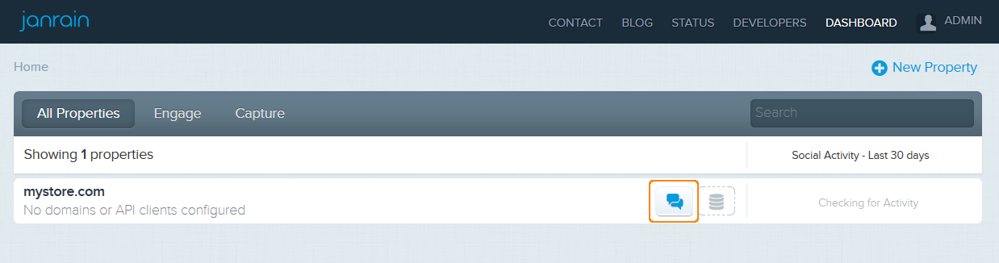
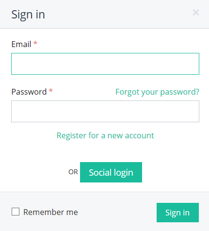

*********************************
How To: Set up the Janrain Add-on
*********************************

Before using this add-on, you need to subscribe to a free or paid `Janrain Engage account <http://janrain.com/product/social-login/plans/>`_:

*	Choose a plan, free `Basic <http://janrain.com/product/social-login/plans/basic/>`_ one , for example.
*	At the bottom of the page click the **Create Account** button.
*	Fill in the appeared form and click the **Create Account** button once again.
*	You will receive a confirmation email to the specified in the form email address. Click the link in this email to confirm your password.
*	Click **Sign in** at the opened page.
*	Fill in the appeared form and click **Sign in**. You will see your Janrain dashboard.

To get **API key** and **Application Domain**:

*	In your `dasboard <https://dashboard.janrain.com/>`_ create an application as described `here <http://developers.janrain.com/how-to/social-login/create-a-social-login-application/>`_.
*	After that, you will see a new property in your dashboard. Click the **Manage Engage app** button:

*	On the opened page in the **Settings** section click **General Settings**.
*	You will see your **API key** and **Application Domain** in the **Application info** section:

.. image:: img/janrain_02.png
	:align: center
	:alt: Settings

Once you have subscribed to JanRain Engage, take these steps:

*   In your CS-Cart administration panel, go to **Add-ons → Manage add-ons**.
*   Make sure the **Janrain** add-on has an *Active* status.
*   Click on the name of the add-on.
*   In the opened window specify the following settings:

    *   **API Key** — specify the value of API Key in your Janrain account.
    *   **Application Domain** — specify the value of Application Domain in your Janrain account.

.. image:: img/janrain_03.png
	:align: center
	:alt: Janrain add-on

*   Click **Save**.

To sign in with social account:

*   In the storefront go to **My account → Sign in**.
*   Click the **Social login** link.

*	Sign in using your account in the social networks.