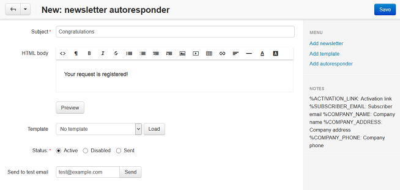

*******************************
How To: Create an Autoresponder
*******************************

To set up an autoresponder:

*   Open the **Add-ons → Manage add-ons** section and make sure that the **Newsletters** add-on has an *Active* status.
*   Go to **Marketing → Newsletters → Autoresponders**.
*   Click the **+** button to add an autoresponder.
*   Fill in the following fields:

    *   **Subject** — enter a subject. This text will be displayed in the e-mail subject.
    *   **HTML body** — enter the e-mail text. This field is used to send the e-mail in the HTML format. Please note that this format is not supported by some e-mail programs. If you are not familiar with HTML, you can add a formatted description using the built-in WYSIWYG editor.
    *   **Template** — select a template. If no template is created, create a template.
    *   **Status** — status of an autoresponder.
    *   **Send to test email** — enter a test e-mail address. Click the **Send** button to send a test email.

*   Click **Create**.

After the autoresponder is created, you can select it for a newsletter.

To assign the autoresponder to a newsletter:

*   Go to **Marketing → Newsletters → Mailing lists**.
*   Click on the name of the mailing list.
*   Find the **Confirmation e-mail** field and select the autoresponder in the drop down box.
*   Click **Save**.

The autoresponder e-mail will be sent to subscriber after he/she is subscribed to the mailing list.