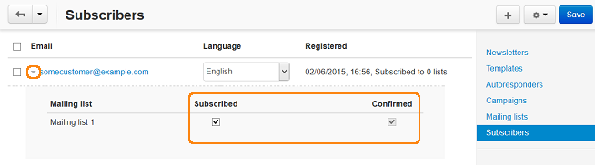

*****************************
How To: Create a Mailing List
*****************************

*   In the Administration panel, go to **Marketing > Newsletters > Mailing lists**.
*   Click the **+** button on the right to add a mailing list.
*   Fill in the following fields:

    *   **Name** — enter the name of the mailing list.
    *   **From name** — enter the name from which the e-mails will be sent.
    *   **From email** — enter the e-mail from which the e-mails will be sent.
    *   **Reply to** — enter the e-mail to which the replies will be sent to.
    *   **Confirmation e-mail** — choose an autoresponder for this mailing list (e.g., it can be sent to confirm subscriptions or unsubscriptions, etc.)
    *   **Show at checkout** — select if you would like to display the subscription block at checkout.
    *   **Show on registration** — select if you would like to display the subscription block at registration.
    *   **Status** — select the desired mailing list status.

*   Click **Create**.
*   The **Mailing lists** section will be displayed in the storefront, and customers will be able to subscribe to the list.

.. image:: img/mailing_lists.png
	:align: center
	:alt: Mailing lists

To add subscribers to the mailing list:

*   Go to **Marketing > Newsletters > Subscribers**.
*   Click the pointer icon of a subscriber, new small section will be displayed. Tick the **Subscribed** and **Confirmed** check boxes of the mailing list and click **Save**.

*   Or click the **+** button on the right and choose **Add subscriber**, fill in the necessary fields in the opened window, and click **Create**.