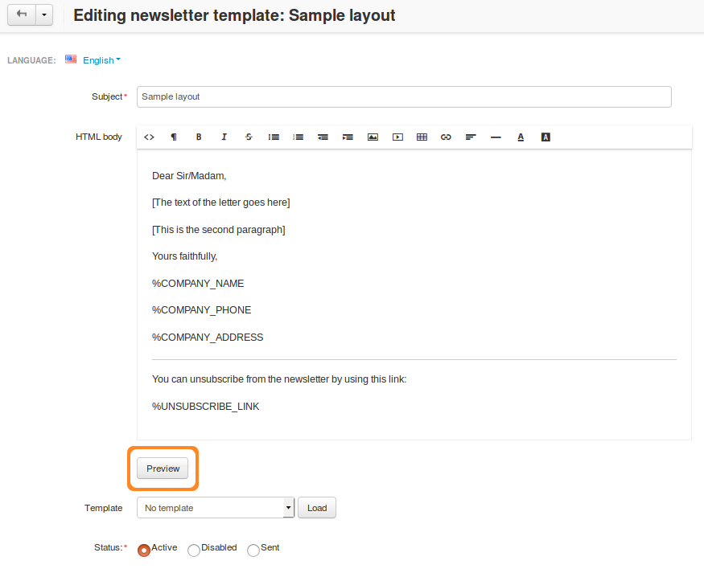
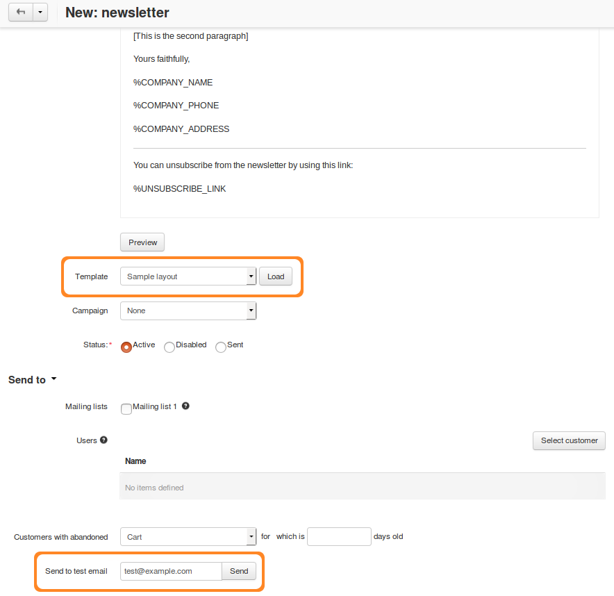

************************************
How To: Create a Newsletter Template
************************************

.. note::

    **Tutorial Difficulty: 1 / 3**

You can create templates for your future :doc:`newsletters <send_newsletter>`.

==============
Add a Template
==============

1. In the Administration panel, go to **Marketing → Newsletters → Templates**.

2. Click the **+** button in the top right corner of the page.

3. Fill in the following fields:

   * **Subject**—the subject of the template.

   * **HTML body**—the content of the template. You can use the visual editor or enter HTML code.

   * **Template**—this setting allows you to copy **HTML body** from another template. To do it, select the template from the dropdown list and click the **Load** button.

     .. warning::

         Loading a template will replace anything you entered in the **HTML body** field.

   * **Status**—select status.

4. Click the **Save** button.

You will be able to load the created template when editing a newsletter.

.. image:: img/templates.png
	:align: center
	:alt: Add templates

============
Placeholders
============

You can use placeholders in the HTML body of your template. These placeholders will be replaced by the actual data when the newsletter is sent:

* ``%UNSUBSCRIBE_LINK``—the link that allows to unsubscribe from the mailing list.

  .. important::

      If you specify ``%UNSUBSCRIBE_LINK`` in your newsletter, it will only appear for the customers from mailing lists. It won't appear for customers with abandoned carts/wishlists.

* ``%ACTIVATION_LINK``—the link that allows to activate your email subscription.

* ``%SUBSCRIBER_EMAIL``—the email to which the letter is sent.

* ``%COMPANY_NAME``—the name of the company.

* ``%COMPANY_ADDRESS``—the address of the company.

* ``%COMPANY_PHONE``—the phone number of the company.

=====================
Preview Your Template
=====================

-----------------------------
Way 1. Use the Preview Button
-----------------------------

1. In the Administration panel, go to **Marketing → Newsletters → Templates**.

2. Click the name of the desired template to open its editing page.

3. Click the **Preview** button. The template will open in the new tab in your browser.

-----------------------------
Way 2. Send a Test Newsletter
-----------------------------

You can preview the template by sending a test newsletter to the email address of your choice:

1. Make sure to save your template.

2. Go to **Marketing → Newsletters → Newsletters**.

3. Click the **+** button in the top right corner of the page.

4. Fill in the **Subject** field.

5. Choose your template from the dropdown menu of the **Template** setting, and click **Load**.

6. Enter the email where you want to send the test newsletter in the **Send a test email** field.

7. Click the **Send** button next to the email field.

