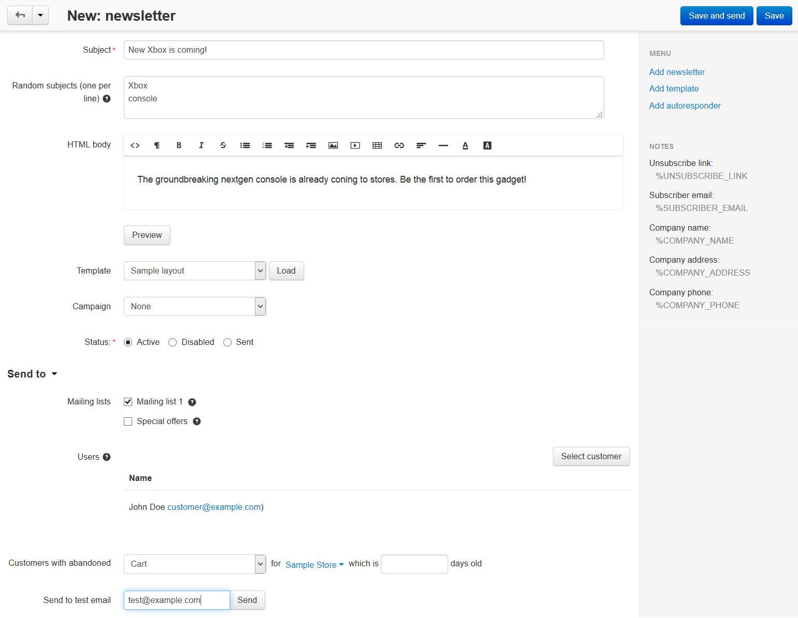

*************************
How To: Send a Newsletter
*************************

.. note::

    **Tutorial Difficulty: 1 / 3**

1. In the Administration panel, go to **Marketing → Newsletters → Newsletters**.

2. Click the **+** button in the top right corner of the page.

3. Fill in the following fields:

   * **Subject**—the subject of the newsletter.

   * **Random subjects** (one per line)—you can enter several newsletter subjects, if needed. If you send this newsletter several times, the subject will be selected from this list randomly.
       
   * **HTML body**—the content of the newsletter. You can use the visual editor or enter HTML code.

   * **Template**—select a :doc:`newsletter template <create_template>` (if you have any) and click the **Load** button next to it.

     .. warning::

         Loading a template will replace anything you entered in the **HTML body** field.

   * **Campaign**—select a campaign (if you have any).

   * **Status**—select the status of the newsletter.

4. Specify the newsletter recipients in the **Send to** section:

   * **Mailing lists**—select mailing list.

     .. important::

         If you specify ``%UNSUBSCRIBE_LINK`` in your newsletter, it will only appear for the customers from mailing lists.

   * **Users**—click the **Select customer** button and add any registered customers to the list of recipients.

   * **Customers with abandoned Cart/Wishlist for ... which is ... days old**—choose whether to send the newsletter to customers with abandoned carts, wishlists, or both. 

     You can limit to whom the newsletter will be sent by store or by the number of days since when the cart/wishlist was abandoned.

   * **Send to test email**—enter the email where you want to send the test newsletter. Click the **Send** button next to the field to send the newsletter to that email.

5. Click the **Save and send** button.

