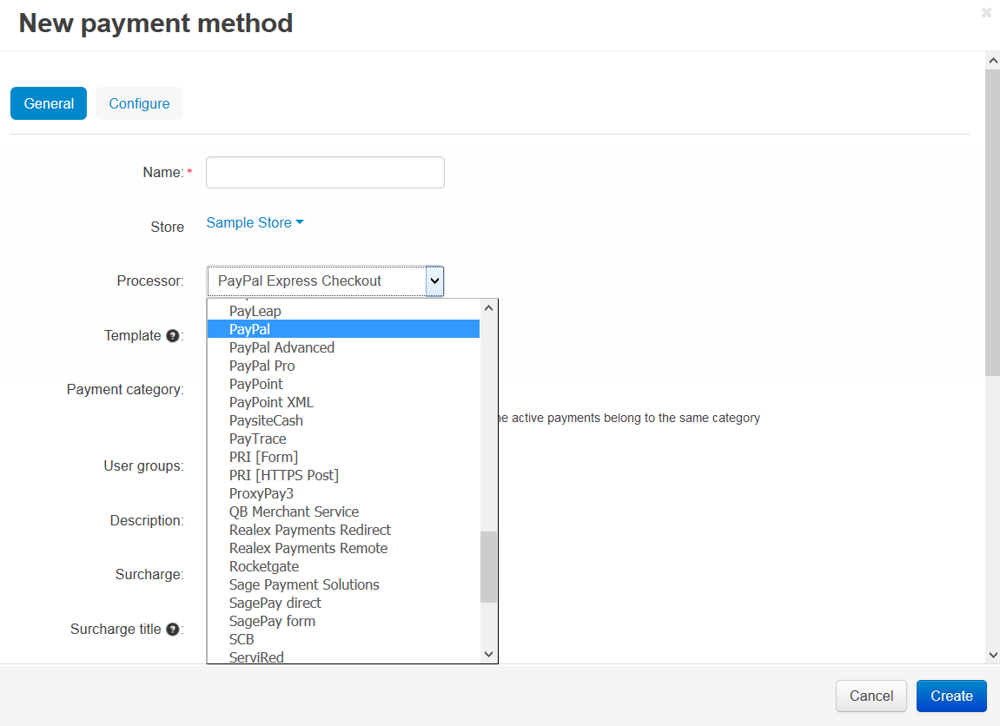
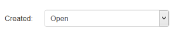

***************
PayPal Payments
***************

With this add-on you can accept payments via PayPal Express Checkout, PayPal Pro, PayPal Standard, PayPal Advanced, and PayPal Payflow Pro. When you install the add-on, the corresponding payment processors are added to the list of the available processors on the payment method adding page.

===============
In This Section
===============

.. toctree::
    :maxdepth: 2
    :titlesonly:
    :glob:

    *

======================
Configuring the Add-on
======================

To configure the following settings go to **Add-ons → Manage add-ons** and click on the **PayPal payments** add-on name.

-------------------------------------
Instant payment notification settings
-------------------------------------

* **Override customer info**—tick this checkbox, if you want customer profile information in your store to be replaced with the info sent from PayPal.

----------------------------------
PayPal order status conversion map
----------------------------------

Here you can choose statuses in your store, to which corresponding PayPal order statuses will be converted. To change a status, just click on it and choose the new one from the drop-down list.

For example, the following record means that the order received from PayPal with the *Created* status will be converted to the order with the *Open* status in your store.

--------------------
PayPal logo settings
--------------------

* **PayPal logo**—an image that will be placed at the top of the cart review area at PayPal side. Use a valid graphics format, such as .gif, .jpg, or .png. Limit the image to 190 pixels wide by 60 pixels high. PayPal crops larger images.

=========
Also Read
=========

* :doc:`How To: Set PayPal in CS-Cart <../../payment_methods/paypal>`
* :doc:`How To: Set up CS-Cart with PayPal Express <../../payment_methods/paypal_express>`
* :doc:`How To: Set up CS-Cart with PayPal Pro <../../payment_methods/paypalpro>`
