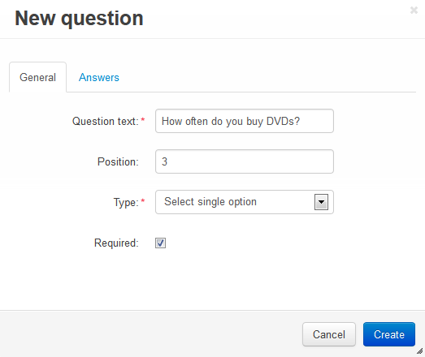

*********************
How To: Create a Poll
*********************

To set up the **Polls** add-on:

*   In the Administration panel, go to **Add-ons > Manage add-ons**.
*   In the **Installed add-ons** tab find the **Polls** add-on and hange its status to *Active*.
*   Click on the name of the add-on.
*	Complete the following fields:

	*	**Votes on page** – Number of surveys and polls appearing on a single page.
	*	**Answers on page** – Number of answers appearing on a single page.

*	Click the **Save** button.

.. image:: img/polls_01.png
	:align: center
	:alt: Polls add-on

To create a poll:

*   Go to **Website > Content**.
*   Click the **+** button and choose **Add poll**.
*   Fill information in the **General** tab.
*   Open the **Poll** tab, fill in the fields and click the **Create** button. New tabs will appear.
*   Open the **Questions** tab and click the **Add question** button on the right.
*   Type the question in the **Question** text field and select option in the **Type** select box.

*   In the opened window open the **Answers** tab and click the **+** button on the right to add more rows. Then enter answer variants and click the **Create** button.

.. image:: img/polls_03.png
	:align: center
	:alt: New question. Answers

To display a poll:

*   Go to **Design > Layouts**.
*   Select the page where the poll will be displayed by clicking on the corresponding tab at the top. For example, click **Homepage** at the top to show the poll on the homepage.
*   In the container where you want to display the poll, click the **+** button and choose **Add block**. Open the **Create New Block** tab and choose **Polls**.
*	In the opened window specify the name of the block (e.g. *New Poll*), select *Side box* in the **Template** select box and click the **Create** button.
*   Click on the gear icon of the created block and select:

    *   Select the desired wrapper in the **Wrapper** select box.
    *   Specify the desired css-class in the **User-defined CSS-class** input field, if needed.

*   Open the **Content** tab and in the **Filling** select box select *Manually*.
*   Click the **Save** button.

.. image:: img/polls_04.png
	:align: center
	:alt: Polls block

*   Open the **Content** tab, click the **Add polls** button, select the desired poll, and click the **Add polls and close** button.

.. note ::

	After the block is created or changed, make sure it is displayed correctly. Sometimes not all wrappers are suitable for the blocks.

