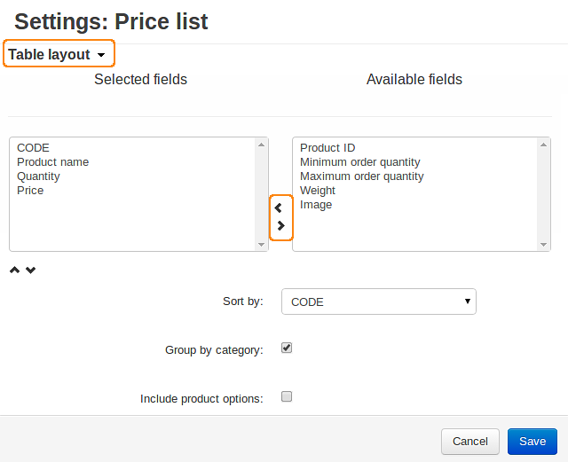
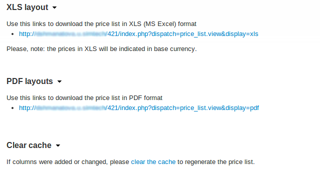

************************************
How To: Set up the Price List add-on
************************************

To set up the **Price list** add-on:

*   In the Administration panel, go to **Add-ons > Manage add-ons** and enable the **Price list** add-on (change its status to *Active*).
*   Click on the name of the add-on.
*   In the **Table layout** section select what fields the price list will contain.

.. note ::

	Using the horizontal arrows you can move items from the **Available fields** section to the **Selected fields** and vice versa. To move the fields inside the **Selected fields** section use the vertical arrows.

*   Enter/select the parameters in the following fields:

    *   **Sort by** — the parameter by which products in the price list will be sorted.
    *   **Group by category** — if selected, products in the price list will be grouped by category.
    *   **Include product options** — if selected, the price list will contain product options.

To generate the price list in XLS and PDF formats use the links given in the **XLS layout** and **PDF layout** sections respectively.

*   Click the **Save** button.
