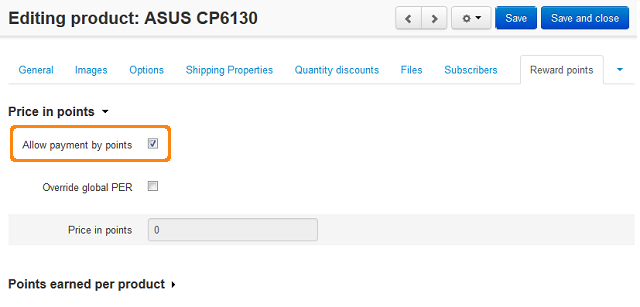

*********************************************************
How To: Set up Product Price in Points According to Ratio
*********************************************************

*   In the Administration panel, go to **Add-ons > Manage add-ons**.
*   Click on the name of the **Reward points** add-on.
*   Enter the number of reward points in the **oints Exchange Rate (PER - the number of points equal to 1 conventional unit)** input field.
*   Click **Save**.
*   Go to **Products > Products**.
*   Click on the name of the product.
*   Open the **Reward points** tab.
*   Tick the **Allow payment by points** check box.
*   Click the **Save and close** button.

.. note ::

    In order to enable the **Allow payment by points** option for all the products at once use the **Edit selected** functionality. Please refer to `this article <http://docs.cs-cart.com/4.3.x/user_guide/manage_products/products/same_value_all_products.html>`_.

.. note ::

    Make sure that the **Override global PER** option is disabled for the products for which you want to set up price in points according to ratio.