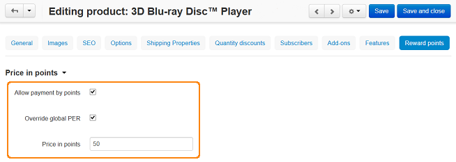

***********************************************
How To: Set up Product Price in Points Manually
***********************************************

*   In the Administration panel, go to **Add-ons → Manage add-ons** and :doc:`enable the Reward points add-on <../reward_points/set_rp_addon>`.
*   Go to **Products → Products**.
*   Click on the name of the product for which you want to set up the price in points.
*   Open the **Reward points** tab.
*   Tick the **Allow payment by points** check box.
*   Tick the **Override global PER** check box.
*   Enter the value in the **Price in points** input field.
*   Click the **Save** button.

