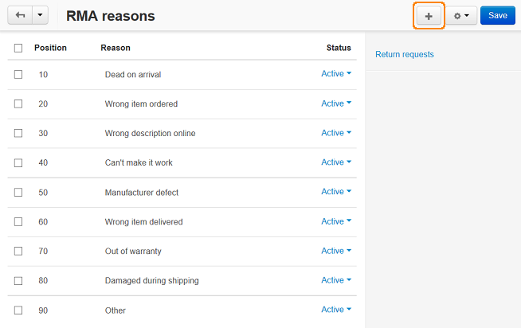
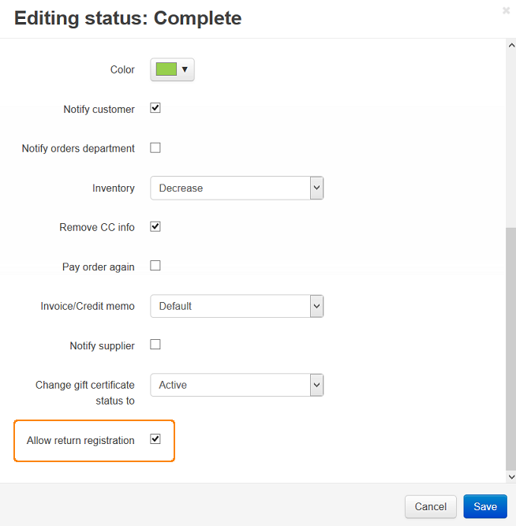

*****************************
How To: Set up the RMA Add-on
*****************************

To enable the **RMA** add-on:

*   In the Administration panel, go to **Add-ons > Manage add-ons**.
*   Enable the **RMA** add-on (change its status to *Active*).
*   Click on the name of the **RMA** add-on.
*   Select the desired options and tick the check boxes, if needed:

    *	**Display product return period** - If selected, product return period is displayed on the storefront.
	*	**Do not take weekends into account when calculating product return period** - If selected, Saturdays and Sundays are excluded from the return period.

*  Click **Save**.

.. image:: img/rma_01.png
    :align: center
    :alt: RMA add-on

To set up return registration:

*   Go to **Orders > Return requests**.
*   Click the gear button in the top right corner of the page and choose **RMA reasons**.
*   Click the **+** button and create a reason why a customer will be able to return products.

*   Click the gear button in the top right corner and choose **RMA actions**. Change the **Status** of the actions to *Active*. 
*   Click **Save**.

.. image:: img/rma_03.png
    :align: center
    :alt: RMA actions

*   Click the gear button in the top right corner of the page and choose **RMA request statuses**.
*   To add a new request status, click the **+** button. To edit the existing status, click on its name.
*   Click **Save**.
*   Go to **Administration > Order statuses**.
*   Click on the order status for which you want to allow return and tick the **Allow return registration** check box.
*   Click **Save**.

