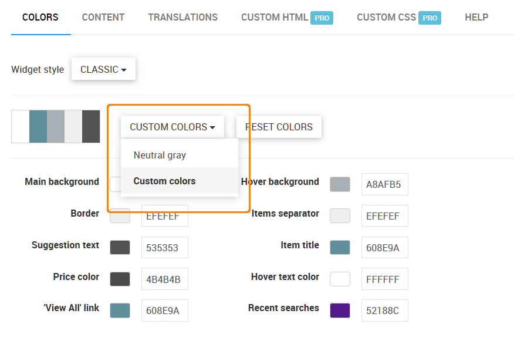

*********************
Instant Search Widget
*********************

Configure widget
****************

The search bar gets seamlessly integrated with the current theme of the storefront. Still there is a room for fine-tuning the outwards appearance of the auto-complete form and the product preview box.

Before configuring the widget, make sure to activate it by selecting the **Enable instant search widget** checkbox. Click **Optimize for phones and tablets** if the search bar is supposed to be used on mobile devices.

Colors
******

Under the **Colors** tab you can edit the color scheme of the widget to make it more aligned to the existing storefront design.

.. image:: img/searchanise_07.png
    :align: center
    :alt: Search widget

To edit the color scheme:

*   Switch the color scheme to **Custom colors**.

*   Enter new hexadecimal values (from *#000000* for black to *#FFFFFF* for white) into corresponding text fields.
*   Type some text in the field near the **Preview changes** button and click this button to test your modifications before saving them. If you want to revert colors to the default, click the **Reset colors** button.
*   Click Apply changes to save the new color scheme.

Content
*******

Under the **Content** tab you can configure the behavior of the widget. The description of the settings under the **General**, **Products**, and **Search Suggestions** sections can be found under the **Help** tab.

Settings under the **Pro features** section are available only in `Searchanise Pro <http://start.searchanise.com/pricing/>`_.

Translations
************

This section provides facilities for translating the Searchanise search widget. To translate the text, write it's translation in an editable text box and save the changes.

Custom HTML
***********

.. note ::

    This section is available only in **Searchanise Pro**.

Here you can edit the HTML code of some instant search widget elements. Activate the **Show content on focus** checkbox above the HTML content to make it editable. Activate the **Syntax highlighter** checkbox to show the HTML structure.

.. image:: img/searchanise_09.png
    :align: center
    :alt: Custom HTML

Do not forget to click the **Apply changes** button when you are ready.

Custom CSS
**********

.. note ::

    This section is available only in **Searchanise Pro**.

Use custom CSS styles to customize the look and feel of the instant search widget. Activate the **Syntax highlighter** checkbox to show the CSS structure.

Activate the **Show content on focus** checkbox above the CSS content to make it editable. Do not forget to click the **Apply changes** button when you are ready.