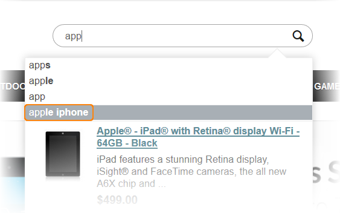
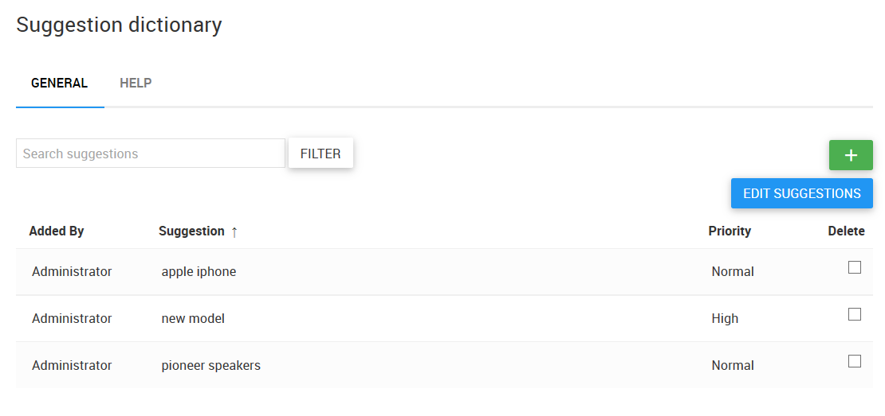

*********************
Suggestion Dictionary
*********************

In this section you can see the list of phrases that will appear among the suggestions, when a customer starts to type the first word of the phrase in the search bar.

In the **General** tab there is the list of suggestions. The description of the fields you can find under the **Help** tab.

To search for a particular suggestion, type it in the **Search suggestions** field and click the **Filter** button.

To **add** a suggestion:

1.  Click the **+** button to the right.
2.  In the opened section type a suggestion in the editable field and choose its priority.
3.  If you want to add more suggestions, click the **+** button below.
4.  Click the **Save phrases** button when you are ready.

If you do not want to save any changes, click the **Cancel** button.

To **edit** a suggestion:

1.  Click the **Edit suggestions** button.
2.  Edit the **Suggestion** field of the desired phrase and change its priority, if needed.
3.  Click the **Save changes** button.

If you do not want to save any changes, click the **Cancel** button.

To **delete** a suggestion:

1.  Choose the checkboxes of the desired suggestions in the Delete row and click the **Delete selected** button.
2.  In the opened window click **OK** to confirm the action.