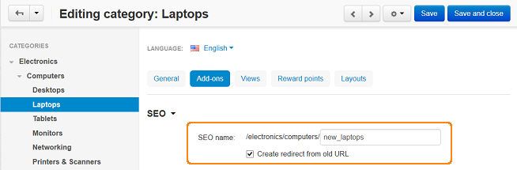
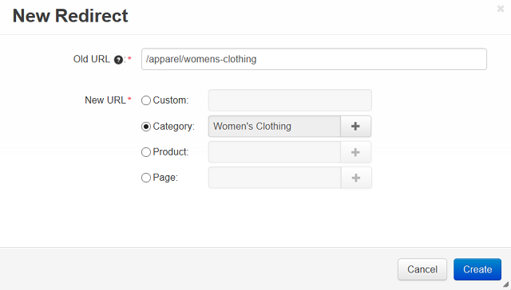

*************
301 Redirects
*************

When you install the **SEO** add-on, the **301 redirects** tab appeares in the **Website > SEO** section. With this functionality you can redirect customers from old and no more actual pages to the new ones.

.. important ::

	Redirect from an object will work only if this object was not found.

Redirects can be added to this list authomatically or manually:

Page URL is added to this list authomatically when you change its SEO-name in the item (category, product, etc.) editing section. For example:

*	Go to **Products > Categories** in the administration panel and open some category editing page.
*	Choose the **Add-ons** tab and change the **SEO name** field.
*	Make sure that the **Create redirect from old URL checkbox** is active.
*	Click **Save and close**.

URL of the corresponding page will be added to the **Website > SEO > 301 redirects** section.

To add a redirect manually:

*   Go to **Website > SEO > 301 redirects**.
*   On the opened page click the **+** button in the right upper part of the page.
*   In the opened window fill in the **Old URL** field. For example, if your URL is *http://example.com/path/to/object*, you need to enter */path/to/object*.
*   In the **New URL** field define new page URL, where visitors will be redirected when clicking an old page. *Custom* - define URL by yourself, *Category/Product/Page* - choose the desired item from the list.
*   Click **Create**. New redirect will be added to the list.

