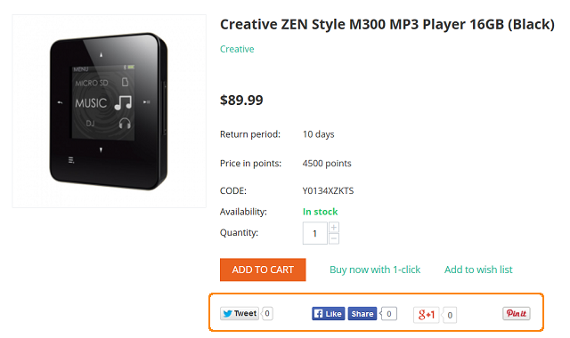

**************
Social Buttons
**************

This add-on provides the ability to add social buttons to the storefront. With the help of the social button the user can express that he/she likes, enjoys or supports certain content.

It is possible to display the quantity of users who liked each content and show a list of them. This is an alternative to other methods of expressing reaction to content, like writing a reply text.

.. toctree::
    :maxdepth: 2
    :titlesonly:
    :glob:

    sb_settings

