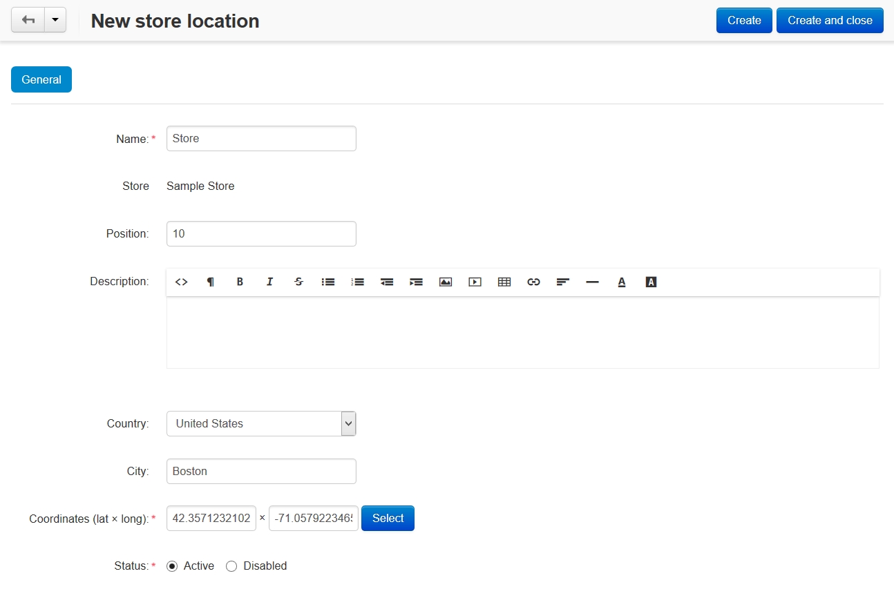
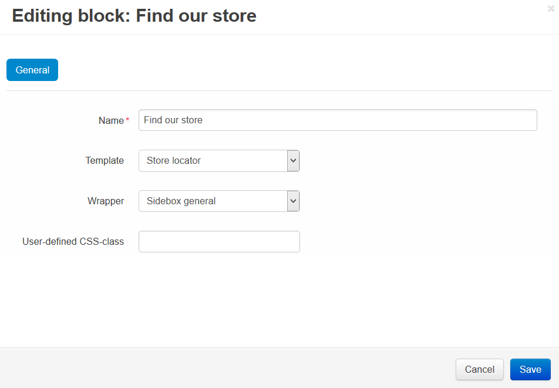

***********************************
How To: Add the Store Locator Block
***********************************

To set up the **Store locator** add-on:

*   In the Administration panel, go to **Add-ons → Manage add-ons**.
*   Enable the **Store locator** add-on (change its status to *Active*).
*   Click on the name of the add-on, enter your Google Maps API key in the **API key** input field and click the **Save** button.

.. note ::

	You can get Maps API key `here <http://code.google.com/apis/maps/signup.html>`_ (you need to have Google Account).

*   Go to **Add-ons → Store Locator**.
*   Click the **+** button to add store location.
*   Fill in the necessary fields and click the **Create and close** button.

 
To add the **Store locator** block:

*   Go to **Design → Layouts → Default**.
*   Choose the container where you want to add a **Store locator** block and click the **+** icon on it. Open the **Create New Block** tab and choose **Store locator**.
*	In the opened window:

    *   Enter the name of the block (e.g. *Find our store*).
    *   In the **Template** select box select *Store locator*.
    *   Click the **Create** button.

*   Click the gear button on the created block to see the block options.
*   In the opened window in the **Wrapper** select box select the desired wrapper.
*   Enter the user-defined CSS-class if needed.
*   Click the **Save** button.

The created block will be displayed on the storefront. If a customer enters the store name, city or country in the input field in this block and clicks the **Search** button, he/she will see your store location closest to him on the map.

.. note::

	After the block is created or changed, make sure it is displayed correctly. Sometimes not all wrappers are suitable for the blocks.