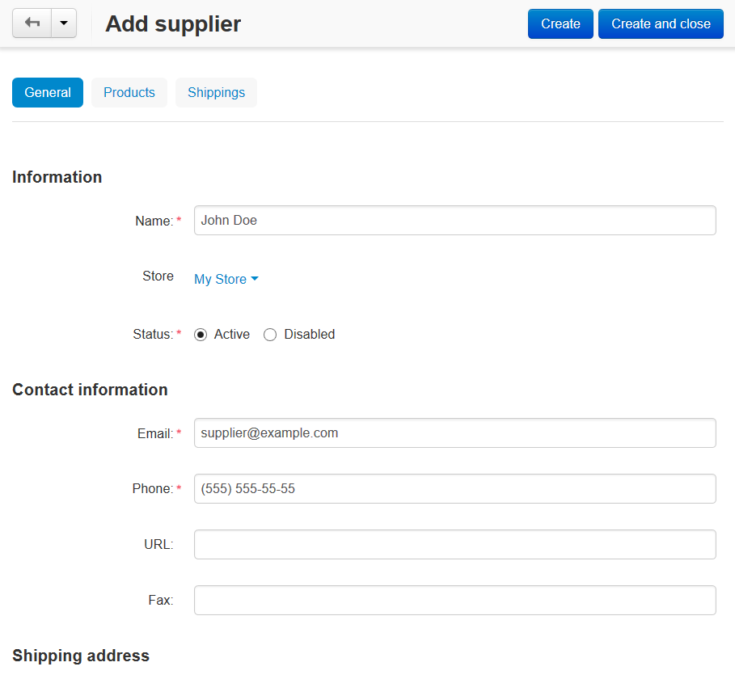
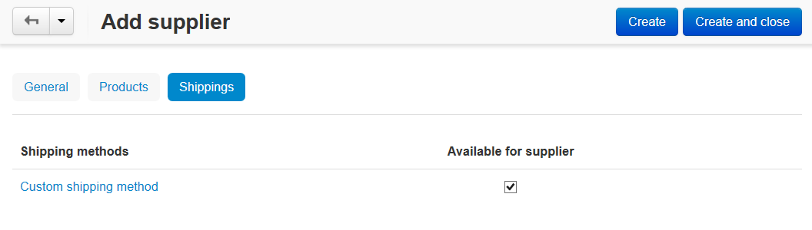

***********************************
How To: Set up the Suppliers Add-on
***********************************

To set up the **Suppliers** add-on:

*   In the Administration panel, go to **Add-ons > Manage add-ons**.
*   Enable the **Suppliers** add-on (change its status to *Active*).
*	Click the gear button of the **Suppliers** add-on to manage the following settings:

	*	**Display product supplier company** - If selected, the name of the supplier company will be displayed on the product details page.
	*	**Display shipping methods to each supplier separately** - If selected, products are displayed for each supplier separately at the checkout. And it is possibly to choose shipping for each supplier.

*	Click **Save**

To add suppliers:

*   Go to **Customers > Suppliers**.
*   Create a new supplier by clicking the **+** button. Define the supplier's **Name**, **Contact information**, and **Shipping address**.

*   Open the **Products** tab and click the **Add product** button to choose the supplier's products.

.. image:: img/suppliers_02.png
    :align: center
    :alt: Add products

*   Open the **Shippings** tab and select shipping methods available for the supplier.

.. important ::

    If a customer buys a product that is assigned to a supplier, only the shipping methods assigned to this supplier will be available.

    If a customer buys several products from different suppliers, several shipping methods (assigned to the suppliers) will be used in the order. The shipping cost will be summed.

.. note ::

	When an order is placed, a notification about it will be sent to the corresponding supplier's email so that he could ship the purchased product(s) to a customer.

.. important::

    In order to hide the supplier name in the customer area, the **Display product supplier company** setting needs to be disabled on the **Suppliers** add-on settings page in the **Add-ons > Manage add-ons** section.