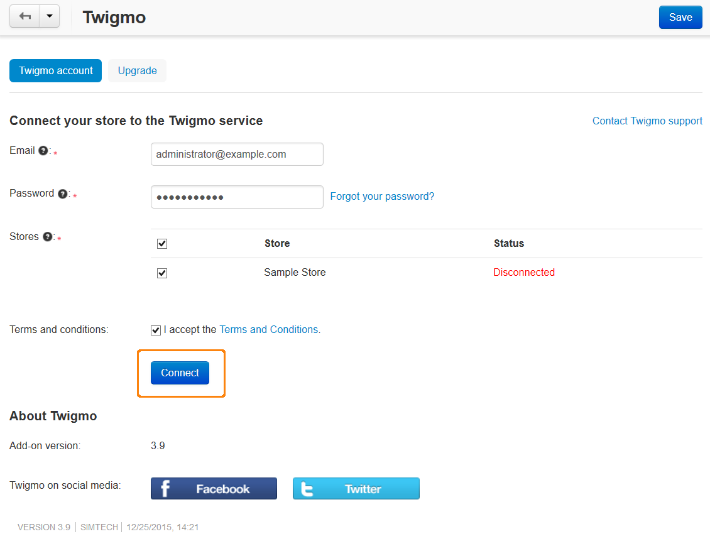
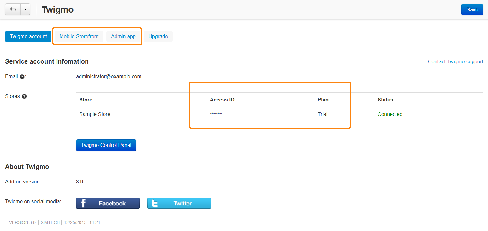

************************************************
How To: Connect Your Store to the Twigmo Service 
************************************************

*	In the Administration panel, go to **Add-ons → Manage add-ons**.
*	Install the **Twigmo** add-on.
*	Click on the name of the add-on to open its settings.
*	In the **Twigmo account** tab in the **E-mail** input field enter your twigmo account e-mail address, complete the **Password** field, and choose stores to be connected to the Twigmo service.
*	Read the **Terms and conditions** and tick the **I accept the Terms and Conditions** check box.

.. note ::

	If you have no Twigmo account, it will be created automatically, and the confirmation letter from Twigmo service will be sent to the e-mail you specified.

*	Follow the **Terms and Conditions** link to read the Twigmo License agreement, select the check box to accept the agreement, and click the **Connect** button.

*	If the connection went properly, the **Access ID** and **Plan** fields will appear on the add-on settings page, as well as the **Mobile Storefront** and **Admin app** tabs:

After connecting the store you will also see the **Twigmo Control Panel** button in the **Twigmo account** tab. Use this button to access your mobile administration panel.