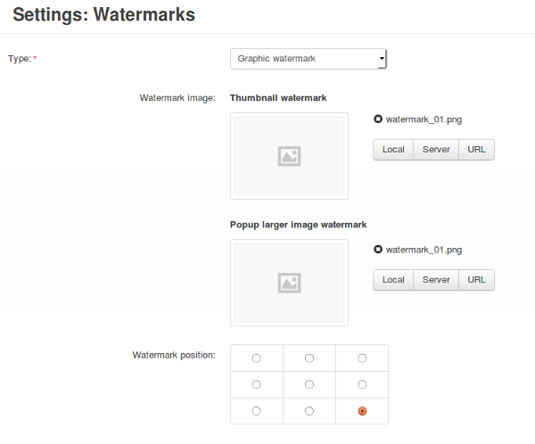
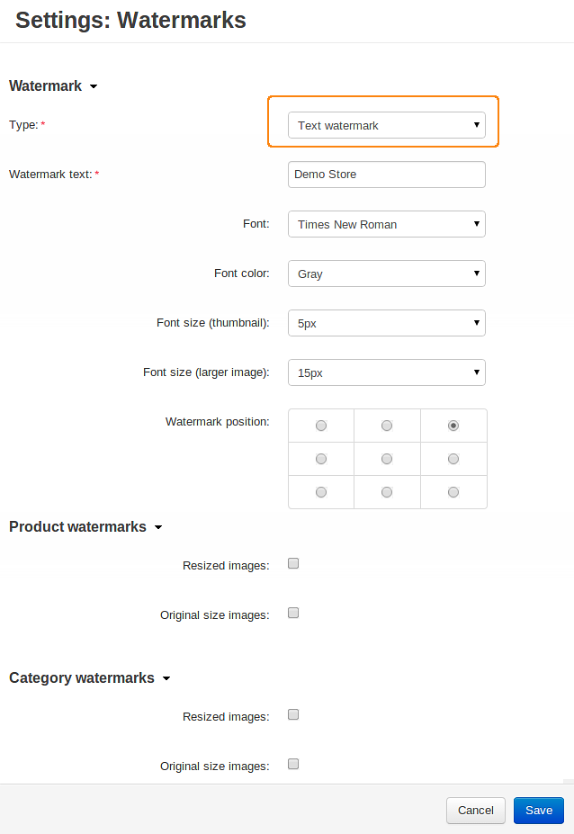

************************************
How To: Set up the Watermarks Add-on
************************************

To set up the **Watermarks** add-on:

*   In the Administration panel, go to **Add-ons → Manage add-ons**.
*   Enable the **Watermarks** add-on (change its status to *Active*).
*   Click on the name of the **Watermarks** add-on.
*   Define your watermarks:

*   If you want to watermark your images with other **images**:

    *   Switch the **Type** setting to *Graphic watermark*.
    *   In the **Thumbnail watermark** section specify the image that you want to watermark all thumbnail images with.
    *   In the **Popup larger image watermark** section specify the image that you want to watermark all detailed product images with.
    *   In the **Watermark position** setting select the radio button that corresponds to the position you want the watermark to be placed on product images.

*   If you want to watermark your images with **text**:

    *   Switch the **Type** setting to *Text watermark*.
    *   In the **Watermark text** field enter the text that you want to watermark all images with.
    *   In the **Font** setting select the font family of the text.
    *   In the **Font color** setting select the color of the text.
    *   In the **Font size (thumbnail)** setting select the font size for thumbnail watermarks.
    *   In the **Font size (larger image)** setting select the font size for detailed product image watermarks.
    *   In the **Watermark position** setting select the radio button that corresponds to the position you want the watermark to be placed on product images.

*   In the **Product watermarks** section select product image type(s) which you want to watermark. Watermarks will not be applied to product image types not selected in this section.
*   In the **Category watermarks** section select category image type(s) which you want to watermark. Watermarks will not be applied to category image types not selected in this section.
*   Click the **Save** button.