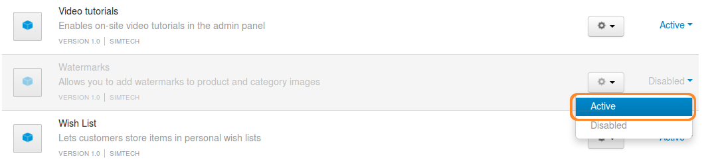
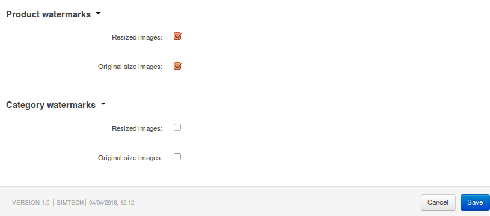
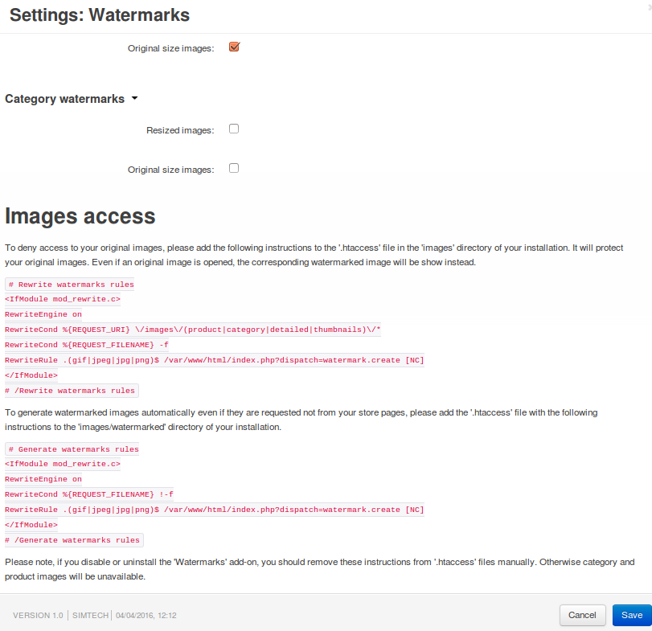

*****************************
How To: Watermark Your Images
*****************************

.. note::

    **Tutorial Difficulty: 1 / 3**

======================================
Step 1. Activate the Watermarks Add-on
======================================

1.1. In the Administration panel, go to **Add-ons → Manage add-ons**.

1.2. Change the status of the **Watermarks** add-on to *Active*.

=================================
Step 2. Configure Your Watermarks
=================================

Open the settings of the **Watermarks** add-on by clicking on the add-on's name.

.. image:: img/watermark_settings.png
    :align: center
    :alt: Open the Watermarks add-on settings.

-----------------------------------------
Way 1. Watermark Images with Other Images
-----------------------------------------

* Set the **Type** to *Graphic watermark*.

* Specify the **Thumbnail watermark**—it will appear on thumbnails.

* Specify the **Popup larger image watermark**—it will appear on detailed product images.

* Select the desired **Watermark position** on an image with radio buttons.

.. image:: img/watermark_01.png
    :align: center
    :alt: Image watermarks.

---------------------------------
Way 2. Watermark Images with Text
---------------------------------

* Set the **Type** to *Text watermark*.

* Specify the **Watermark text** that will appear on the images.

* Select the **Font** of the watermark text.

* Select the **Font color** of the watermark text.

* Select the **Font size** of the watermark text for thumbnails and detailed product images.

* Select the desired **Watermark position** on an image with radio buttons.

.. image:: img/watermark_02.png
    :align: center
    :alt: Text watermarks.

===============================================
Step 3. Select the Images You Want to Watermark
===============================================

3.1. Configure the remaining settings of the add-on:

     * **Product watermarks**—select the types of product images that you want to watermark.

     * **Category watermarks**—select the types of category images that you want to watermark.

     .. note::

         Watermarks will be applied only to the image types that you select in this section.

3.2. Click the **Save** button.

======================================
Step 4. Protect Non-Watermarked Images
======================================

.. note::

    This is an optional step.

4.1. Open the **Watermark** add-on settings again.

4.2. If you selected the images you want to watermark in **Step 3**, you should now see instructions at the bottom of the settings. Follow them to display the watermarked image even when the original image is requested.

.. important::

    These instructions are generated automatically. They are different for CS-Cart and Multi-Vendor, and they depend on the path to your store's directory on your server.

.. warning::

    If you disable or uninstall the **Watermarks** add-on, revert the changes you made in **Step 4**—otherwise category and product images will be unavailable.

