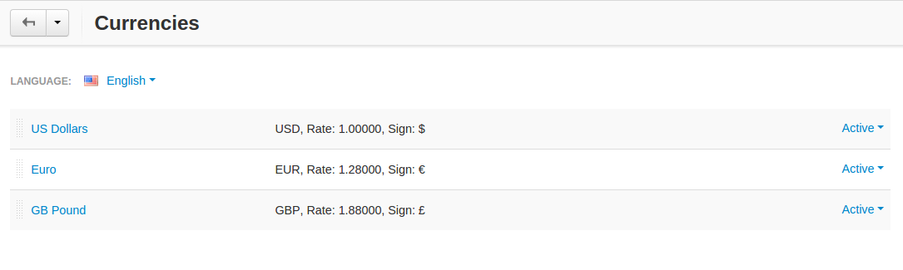
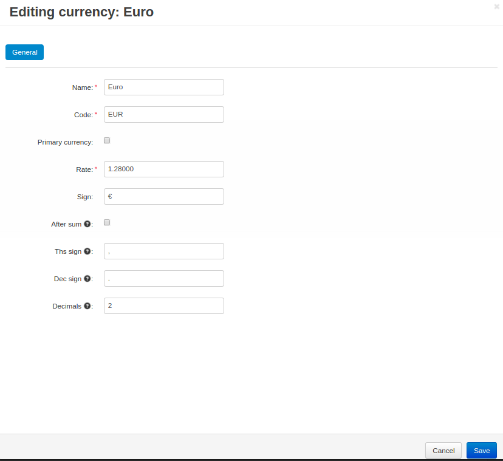

**********
Currencies
**********

Edit the currencies of your store under **Administration → Currencies**.

As a rule, multiple currencies serve to display prices on the storefront. Payments are usually accepted in the store primary currency only. 

However, if your payment gateway is configured to accept payments in different currencies, customers who use this gateway will be charged in an alternative (not primary) currency. 

The order total will be calculated according to the store currency exchange rate that you define here.

.. note::

    All prices you enter in the administration panel are assumed to be in the primary currency.

===================
Currency Properties
===================

-------
General
-------

* **Name**—the name of the currency as it appears on the storefront (USD, Euro, etc.)

* **Code**—the unique code of the currency.

* **Primary currency** (requires a purchased license)—the primary currency of your store.

* **Rate** (requires a purchased license)—the exchange rate to convert store prices and costs from the primary currency to this currency. In the example above, the primary currency is the American dollar, and the values in the **Rate** field define, how many dollars are in one Euro and in one British pound.

* **Sign**—the currency symbol.

* **After sum**—if you enable this setting, the currency symbol will appear after the price. Otherwise, it will appear before the price.

* **Ths sign**—the symbol that separates thousands.

* **Dec sign**—the symbol that serves as the decimal mark.

* **Decimals**—the number of digits after the decimal mark.

* **Status** (requires a purchased license)—currency status: 

  * **Active**—the currency is available on the storefront

  * **Disabled**—the currency is not available on the storefront

-----
Share
-----

Stores that share this currency. :doc:`Learn more about sharing objects among stores <../stores/sharing>`.

.. important::

    The **Share** tab appears only if you have multiple storefronts.
