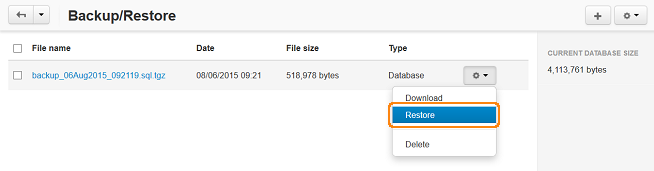

******************************************************
How To: Restore the Database of Your Store from Backup
******************************************************

.. note::

    **Tutorial Difficulty: 1 / 3**

To restore a backup of your store database, complete the following steps:

1. In the administration panel, go to **Administration → Backup/Restore**.

.. note::

    The backup files displayed on the **Backup/Restore** page are located in the *var/backups* directory of your CS-Cart installation.

2. Click the **gear button** in the upper right corner of a page and choose **Upload file**. Specify the location of the file containing the SQL dump. You can retrieve it from: 

 * local computer 
 
 * the server with your CS-Cart installation

 * a remote location (by providing the URL that leads directly to the backup)
 
3. Click the **Upload** button.

You can also select the appropriate dump from the list, if it is located in the default directory *var/backups*. Click the **gear button** of the required file and choose **Restore**.

.. warning::

    When you restore the database from an SQL dump, the existing database tables get overwritten.

.. note::

    If you want to restore the whole store from the backup, make sure that files have the **writable** permissions.

