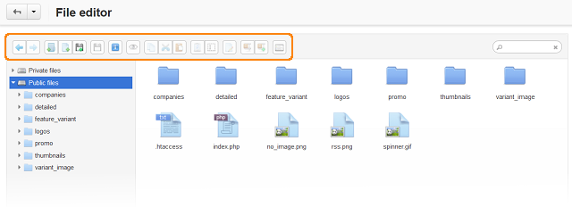

*****
Files
*****

The **File Editor** available under **Administration → Files** allows you to manage files directly from the administration panel.

The highlighted buttons in the picutre below allow you to create, upload, rename and remove files. You can edit **.txt** files and create/unpack archives.
 

 
In the left section of the editor there are two tabs:
 
* **Private files**—the files stored in the *var/files* directory of your installation. 

* **Public files**—the files stored in the *images/companies* directory of your installation.

To search for particular files or directories, use the search field in the top right corner of the editor.

.. toctree::
    :maxdepth: 2
    :titlesonly:
    :glob:

    *
