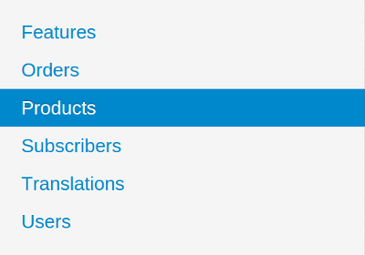
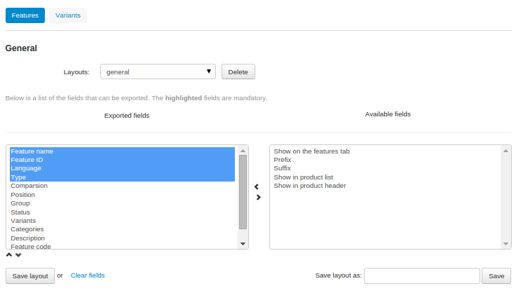
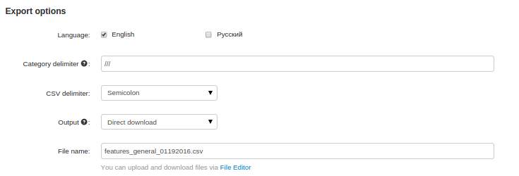

****************************
Importing and Exporting Data
****************************

CS-Cart and Multi-Vendor support bulk data import and export in the **CSV** (comma-separated values) format. You can create and edit **.csv** files in a third-party application that supports this format, like Google Spreadsheets, LibreOffice Calc, Microsoft Office Excel, etc.

To import or export data, go to **Administration → Import data** or **Administration → Export data** respectively.

================
Data Subsections
================

For convenience, the import and export sections are divided into **subsections** according to the data type:

* **Features**—product features;

* **Orders**—order details;

  .. important::

      You can only update order details—adding new records is not supported.

* **Products**—product details, including wholesale prices (i.e., quantity-based discounts);

* **Subscribers**—mailing list subscribers;

* **Translations**—language variables;

* **Users**—user profiles.

To switch between the subsections, use the menu on the right.

======
Import
======

Every subsection may consist of several tabs. Each tab includes two areas: 

* The upper area contains the list of fields that the imported file can include. Mandatory fields are highlighted. 

* The lower area contains the import options. These options may vary depending on the type of the imported data.

.. image:: img/import_example.png
    :align: center
    :alt: Different types of data have different import options and required features.

======
Export
======

The contents of an export file are controlled by two list boxes:

* **Exported fields**—the fields that will be included in the export file.

* **Available fields**—the fields that you can add to the export file. 

To move fields from one list to another, use the twin horizontal arrows between the lists. To change the order of fields in the **Exported fields** list, use the twin vertical arrows below the list box. If necessary, you can save and then re-use a particular layout of the exported fields.

.. note::

    The highlighted fields on the **Exported fields** list are mandatory and thus cannot be removed from the list.

.. hint::

    If you export data regularly, you can save the list of the exported fields: enter the name of your export pattern in the **Save layout as** field and click **Save**. Then you'll be able to select your layout in the **Layout** drop-down list.

--------------
Export Options
--------------

This is the list of all export options. Some of them appear only in specific subsections.

* **Category delimiter**—the delimiter to separate child and parent categories.

* **CSV delimiter**—the delimiter to separate the exported values.

* **File name**—the name of the exported file.

* **Files directory**—the directory where files for downloadable products are located. Used for files without a path specified.

* **Images directory**—the directory where images are located. Used for images without a path specified.

* **Language**—the language of the exported data (two-letter language code.)

* **Output**—the output type: 

  * **Direct download**—the export file will be downloaded to you computer; 

  * **Screen**—the export file content will be shown in the web browser; 

  * **Server**—the export file will be saved on the server where CS-Cart is installed. 

  .. important::

      Regardless of the output type, you can download the file later: go to **Administration → Export Data**, click the **gear** button and choose **Exported files**.

* **Features delimiter**—the delimiter to separate multiple product features.

* **Price decimal separator**—the symbol to be used as the decimal mark in product prices.

.. note ::

  `Here <http://docs.cs-cart.com/4.3.x/user_guide/manage_products/import_export/index.html>`_ you can read more about product Import/Export.