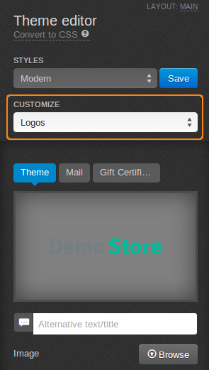

*******************************
How To: Change the Company Logo
*******************************

To replace CS-Cart logo with yours:

*   In the Administration panel, go to **Design > Themes**.
*   In the currently used theme click the **Visual Editor** button.

.. image:: img/logo_01.png
    :align: center
    :alt: The Themes tab

*   In the **Theme Editor** panel select **Logos** from the drop-down menu of the **Customize** field.

*   Choose the **Theme**, **Mail**, and **Gift Certificate** tabs to edit corresponding logos. Click the **Browse** button to upload images for logos.

.. important ::

	You cannot upload logos for default styles. Create a new one first. To do it, click the **Save** button near the style name and type a new style name in the pop up window.

*   Click the **Save** button.