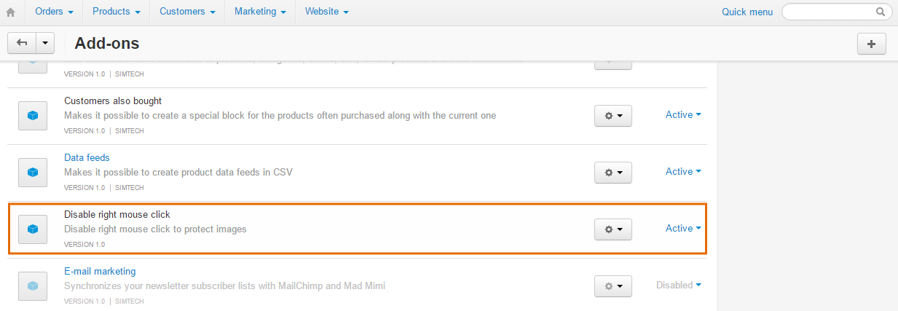

***************************************************
How To: Disable Right Mouse Click to Protect Images
***************************************************

Most browsers allow users to copy any image from a web page by clicking on the image with the right mouse button and choosing the corresponding action from the list. If you don't want the visitors of your store to copy and save images, you can disable the right mouse click in your store.

.. note::

    Disabling the right mouse click does not guarantee full protection of your images, it simply creates an additional deterrent. There are many other ways to copy an image from a web page. For example, a visitor can simply save the web page, and all images on that page will be saved on the visitor's computer.

To disable right mouse click to protect images use the **Disable Right Mouse Click** add-on. 

To get and install this add-on, follow the steps below:

1. Download the Disable Right Mouse Click add-on archive using `this link <https://github.com/cscart/addon-disable-right-click/archive/master.zip>`_.

.. note::

    If you want to check the add-on code, please, visit `the add-on page on GitHub <https://github.com/cscart/addon-disable-right-click>`_.

2. Log in to the Administration panel of your store.

3. Go to **Add-ons → Manage add-ons**.

4. Сlick the **+** button to upload the add-on.

.. image:: img/addons_plus_button.png
    :align: center
    :alt: Add-ons plus button

5. In the pop-up window click **Local**, and choose the add-on archive.

6. Click **Upload & install**.

.. image:: img/upload_and_install_addon.png
    :align: center
    :alt: Upload and install pop-up

The Disable Right Mouse Click add-on is installed and ready for work.

.. note::

    Right mouse click will be disabled immediately after you install and activate the add-on.

.. note::

    If the change doesn't work, try clearing the cache of your store: go to **Administration → Storage** and click **Clear cache**.

.. image:: img/clear_cache.png
    :align: center
    :alt: the Disable Right Mouse Click add-on on the storefront
