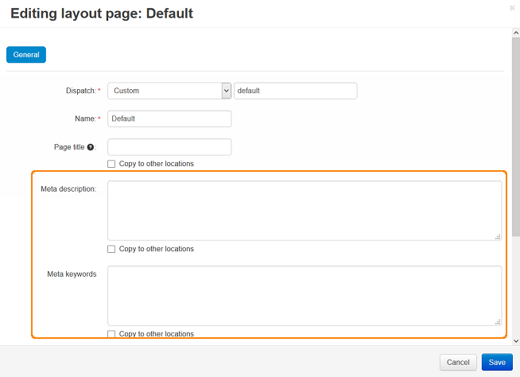

**********************
How To: Edit Meta Tags
**********************

To change the standard CS-Cart Meta tags:

*   In the Administration panel, go to **Design → Layouts**.
*   Click the gear icon on the **Default** tab.

.. image:: img/title_01.png
    :align: center
    :alt: the Default tab

*   In the opened window edit **Meta description** and **Meta keywords** fields.

*   Click the **Save** button.

To change **Meta tags** for the **Products** page, **Categories** page, and other pages:

*   In the Administration panel, go to **Design > Layouts**.
*   Open the tab of the desired layout page.
*   Click the gear icon on the tab.
*   In the opened window edit **Meta description** and **Meta keywords** fields.
*   Click the **Save** button.

.. note:: 

	To add **Meta tags** using the `import <http://docs.cs-cart.com/4.3.x/user_guide/manage_products/import_export/product_import.html>`_ option, use the instructions from the `Imported Fields Format <http://docs.cs-cart.com/4.3.x/user_guide/manage_products/import_export/fields_format.html>`_ article.