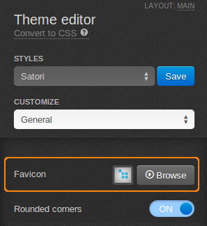

*******************************
How To: Replace CS-Cart Favicon
*******************************

To replace CS-Cart favicon:

*   In the Administration panel, go to **Design > Themes**.
*   In the currently used theme click the **Visual Editor** button.
*   In the **Theme editor** panel on the left find the **Favicon** line and click the **Browse** button.

*   Upload the desired image for the favicon (it must be 16x16 px) and click the **Save** button.

.. important ::

	You cannot upload a favicon for default styles. Create a new one first.