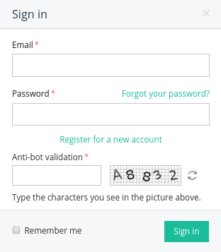

*********************************
How To: Set Up Image Verification
*********************************

Image verification is a way to determine that it's a human being that attempts to do something in your store: create an account, log in to an existing account, leave a comment, etc. If enabled and configured, image verification will allow to perform these and many other actions only if a user enters the text from a randomly generated image.

You can see how image verification works in the picture below: there is a new mandatory *Anti-bot validation* field.

To enable image verification in your store, complete the following steps:

1. In the administration panel, go to **Settings → Image Verification**.

2. Tick the necessary checkboxes in the **Use for** section.

3. Fill in other fields as you see fit.

4. Click the **Save** button.

.. important::

    For displaying verification CS-Cart requires **GD Library** to be installed on the server. PHP must be compiled with **freetype support**. So PHP must be configured with the following keys: ``--with-gd --enable-gd-native-ttf``

.. image:: img/verification_settings.png
    :align: center
    :alt: Image verification settings allow you to determine what actions require anti-bot validation.
