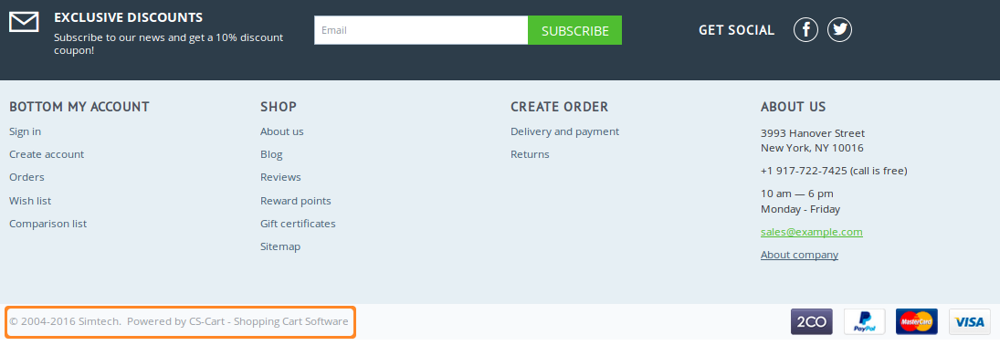
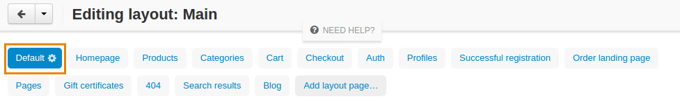
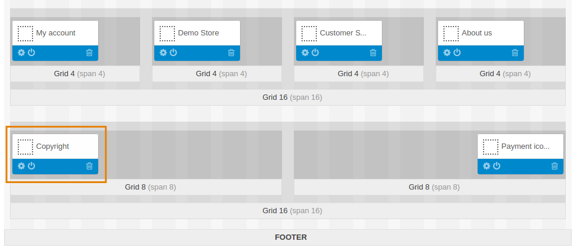
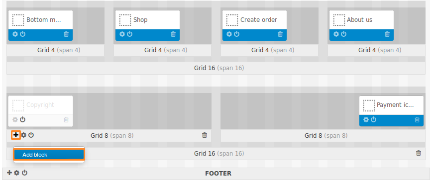
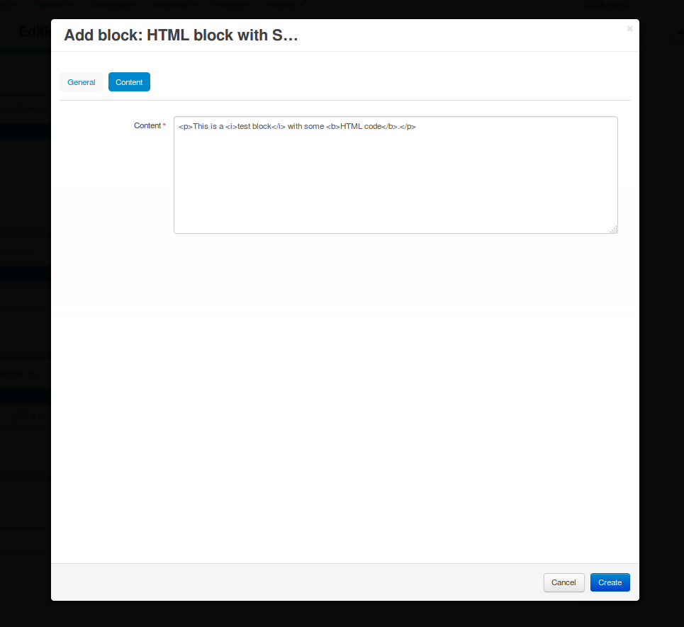

******************************************************
How To: Replace or Delete "Powered by CS-Cart..." Link
******************************************************

By default, the footer of a store contains a link like this:

 © 2004-2017 Simtech. Powered by `CS-Cart - Shopping Cart Software <https://www.cs-cart.com/>`_

This article describes how to remove that link entirely or replace it with something else.

.. note ::

    If nothing changes on the storefront after you follow the instructions, try :doc:`clearing the template cache <../../../developer_guide/getting_started/cache_clearing>`.

=================
Deleting the Link
=================

1. In the Administration panel, go to **Design → Layouts**.

2. Select the **Default** layout.

3. At the bottom of the page find the **Copyright** block, click the **trash can** icon on the block and delete it. 

.. hint::

    Instead of deleting the block, you can deactivate it. Click the **switch** icon to deactivate the block.

==================
Replacing the Link
==================

1. Delete the link as described above.

2. Click the **+** icon of the grid where the **Copyright** block was. Choose **Add block**.

3. A pop-up window will open. It allows you to use one of the existing blocks or create your own. 

   For example, let's switch to the **Create your own block** tab and choose **HTML block with Smarty support**. That block has 2 tabs with properties:

   * **General**—here you can specify the name of the new block.

   * **Content**—here you can enter the actual content that will appear on the storefront. 

   Once you've configured the block, click **Create**.

After performing the steps above, the content of the new block should now appear on your storefront. If nothing has changed, try :doc:`clearing the template cache <../../../developer_guide/getting_started/cache_clearing>`.
