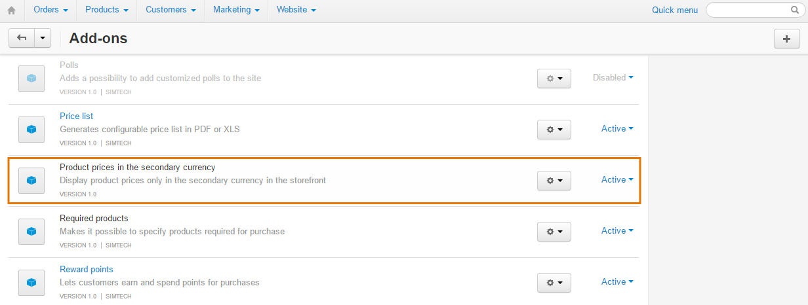
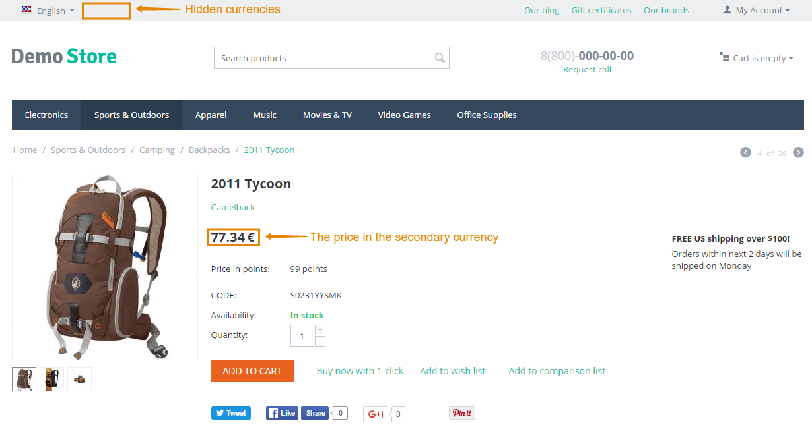

*******************************************************************************
How To: Display Product Prices Only in the Secondary Currency on the Storefront
*******************************************************************************

To be able to set up product prices in one currency but display them in another one on the storefront use the **Product Prices in the Secondary Currency** add-on.

=============================
Step 1. Installing the Add-on
=============================

To get and install this add-on, do the following:

1. Download the Product Prices in the Secondary Currency add-on archive using `this link <https://github.com/cscart/addon-hide-primary-currency/archive/master.zip>`_.

.. note::

    If you want to check the add-on code, please, visit `the add-on page on GitHub <https://github.com/cscart/addon-hide-primary-currency>`_. 

2. Log in to the Administration panel of your store.

3. Go to **Add-ons → Manage add-ons**.

4. Сlick the **+** button to upload the add-on.

.. image:: img/addons_plus_button.png
    :align: center
    :alt: Add-ons plus button

5. In the pop-up window click **Local**, and choose the add-on archive.

6. Click **Upload & install**.

.. image:: img/upload_and_install_addon.png
    :align: center
    :alt: Upload and install pop-up

The Product Prices in the Secondary Currency add-on has been installed.

=========================================
Step 2. Setting up the Secondary Currency
=========================================

To display the correct secondary currency you will need to make some changes in the code of the installed add-on.

1. Open the **hide_primary_currency** folder located in the *app/addons* directory of your CS-Cart installation.

2. In this folder, open the **func.php** file.

3. Replace ``DESIRED_ADMIN_CURRENCY_CODE`` with the 3-symbol code of the currency that you want to use in the Administration panel and ``DESIRED_STOREFRONT_CURRENCY_CODE`` with the 3-symbol code of the currency that you want to use in the storefront.

.. image:: img/prices_in_secondary_currency_02.png
    :align: center
    :alt: The 3-symbol code of the currency.

4. Click **Save changes**.

The Product Prices in the Secondary Currency add-on is ready for work.

.. important ::

    This add-on will hide all your currencies except the one you specify in the code. If you want to keep your other currencies but only select the desired one by default, please use the instructions in `here <http://docs.cs-cart.com/4.3.x/user_guide/look_and_feel/changing_attributes/secondary_currency.html>`_.
