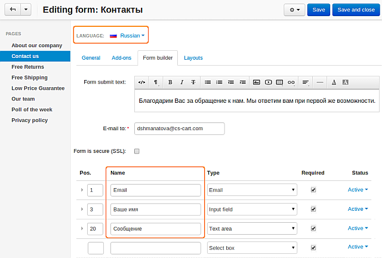

***********************************************
How To: Translate Fields of the Contact Us Form
***********************************************

To translate the fields of the form on the **Contact Us** page, follow the instructions:

1. In the Administration panel go to **Website → Pages**.

2. Click on the **Contact Us** link and switch to the **Form builder** tab.

3. Choose the desired language from the **Language** select box.

4. Replace the values in the **Name** column with your translations.

5. Click the **Save** button to save the changes.

