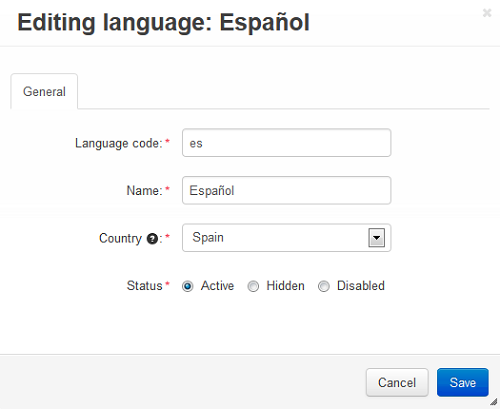

*************************
How To: Translate CS-Cart
*************************

.. important::

    Before you add a new language, check if it already exists at `translate.cs-cart.com <http://translate.cs-cart.com/>`_. 

================================
Download an Existing Translation
================================

To add a new language from *translate.cs-cart.com* to your installation, follow these steps:

1. Go to `translate.cs-cart.com <http://translate.cs-cart.com/>`_, find the desired language, and click on its name.

2. Save the file.

3. Open the administration panel of your store.

4. Go to **Administration → Languages → Manage languages**.

5. Click the **+ button** in the right upper corner of the page to add a language.

6. A new page will open; use it to upload a language file in the PO format, that you have previously downloaded from *translate.cs-cart.com*.

7. Click the **Install** button. The new language will appear in the list of installed languages.

========================
Create a New Translation
========================

.. note::

    Before you create a new translation, make sure that the desired language is not on the list of available languages—check the **Available** tab under **Administrtation → Languages → Manage languages**. Also, make sure there is no such language at `translate.cs-cart.com <http://translate.cs-cart.com/>`_.

1. Go to **Administration → Languages → Manage languages**.

2. Click the **gear button** next to any existing language and choose **Clone**. 

3. Enter the two-letter language code in the pop-up window. A new language will be added to the **Inatalled** list (it will be the copy of the existing language). The select box allowing users to choose a language will be displayed in the customer area and on the store administration panel.

4. Click the **gear button** next to the newly created language and choose **Edit** from the drop-down menu.

5. Fill in the fields and click the **Save** button.

=================
Translate CS-Cart
=================

Most of CS-Cart texts are stored in the so-called language variables. Although you can view and edit all those variables under **Administration → Languages → Translations** tab of the **Languages** page , we recommend a different way:

1. Open the administration panel and go to **Administration → Languages → Translations**.

2. Click the **gear button** in the right upper corner of the page and choose **On-site live editing** from the drop-down menu. 

3. You will be redirected to the storefront and will need to translate the text marked with a dash line. To do it, follow these steps:

 * Choose the newly created language from the drop-down menu in the left upper corner of the page.

 * Hover the mouse pointer over text marked with a dash line. The **edit icon** will appear—click it.

 * Enter the desired translation in the input field.

 * Click the **green tick button** to save your changes.

4. After you translate all visible texts, there are still some language variables left: the ones displayed in the e-mail notifications and in some special situations, i.e. error notifications, popup window messages etc. To translate the remaining variables, follow these steps:

 * Go to **Administration → Languages → Translations** 

 * Select the newly created language in the select box in the top left corner. 

 * Now you can edit the text variables for this language.

 * Translate the texts in the **Value** input fields of the language variables.

.. important::

   Be careful—if *English* is selected in the language select box, you will be editing the English texts.

.. image:: img/translations.png
    :align: center
    :alt: You can translate CS-Cart from the administration panel.

.. important::

    **Do not translate or remove the words in square brackets written in lowercase**, i.e. ``[link]``, ``[product]``, etc. These are variables that will be replaced with an appropriate value automatically when they appear on the storefront. For example, ``[product]`` will be replaced with the corresponding product name.

.. important::

    **Translate the words written in square brackets in uppercase**, i.e. ``[ALREADY PATCHED]``, ``[DELETED]``, ``[FAILED]``, ``[NON WRITABLE]``, etc. These are the notifications generated by the **Upgrade Center** and should be translated.

* Click on the **Save** button to save the changes you made to the language variables on this page.

.. important::

    **Save your changes on every page** where you translate language variables. If you open the next page with language variables without clicking on the **Save** button on your current page, the translations you made on the page will be lost.

5. Make sure to translate the content of the following pages in the administration panel, as they affect the storefront too:

* **Administration → Order statuses**

* **Marketing → Gift Certificates → Gift Certificate Statuses**

* **Administration → Profile fields**

* **Customers → User Groups**

* **Administration → Shipping & Taxes → Shipping Methods**

* **Administration → Shipping & Taxes → Countries**

* **Administration → Shipping & Taxes → States** (if required)

* **Administration → Payment Methods**

* **Administration → Currencies**

* **Design → Layouts**

* **Website → Content → Forms** (the Contact us page)

6. You might need to translate the following pages, if you enabled the corresponding add-ons:

* **Marketing → Gift Certificates**

* **Orders → Return Requests → RMA Request Statuses** (translate this page if you plan to use the RMA addon)

* **Marketing → Banners**

* **Website → News**

* **Products → Products**

* **Products →  Categories**

* **Products → Features**

* **Products → Filters**

* **Products → Options**

To translate the entries on the pages listed above, follow the steps below:

* Open the necessary page and select the desired language in the language section in the top left corner of the page.

* Open the entry (e.g. **order status**) editing page, enter the necessary information for the selected language in the new window, then click the **Save** button.

* Repeat the previous step for the other entries on the page.

.. important::

    We recommend :doc:`closing the store <../changing_attributes/store_closed>` when the **On-site text editing** is enabled: it displays debugging information on the storefront, and that may confuse your customers.

You can also :doc:`contribute to CS-Cart localization via Crowdin <crowdin>`.
