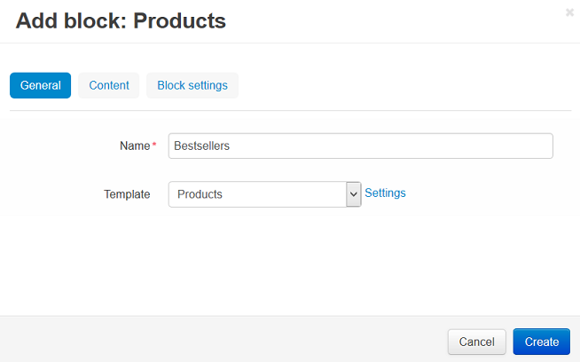

*****************************************
How To: Add a New Block to the Storefront
*****************************************

.. warning::

    This article may no longer be relevant or up to date. Please :doc:`return to the main page of the section. <index>`

To create a new block:

*   In the Administration panel, go to **Design → Layouts**.
*   Click the **+** button in the necessary container and click **Add block**. Open the **Create New Block** tab and click the desired block type button.
*   In the opened window enter the block name, select the desired template in the **Template** select box.

*   Open the **Content** tab and select the desired filling type in the **Filling** select box.
*   Click the **Create** button.
*   Click on the gear icon of the created block and do the following:

    *   Specify the desired css-class in the **User-defined CSS-class** input field.
    *   Select desired wrapper in the **Wrapper** select box.
    *   Click the **Save** button to save the changes.

.. image:: img/add_block_01.png
    :align: center
    :alt: Edit block

*   Drag and drop your block if you want to change its position relatively to other blocks.
