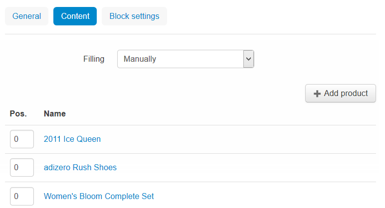

*******************
Block Filling Types
*******************

Block filling type is defined under the **Content** tab of the block properties form.

.. _all:

All
***

With this filling type, the block contains all items of the selected type.

.. _also_bought:

Also bought
***********

With this filling type, the block contains links to product that are usually bought together with the product that the visitor scans at the moment.

This filling type is available when the `Customers also bought <http://www.cs-cart.com/documentation/reference_guide/index.htmld?administration_add_ons_customers_also_bought_2.htm>`_ add-on is installed and activated.

.. _bestsellers:

Bestsellers
***********

With this filling type, the block contains links to products that are sold best in the store.

This filling type is available when the `Bestsellers & on sale products <http://www.cs-cart.com/documentation/reference_guide/index.htmld?administration_add_ons_bestsellers_2.htm>`_ add-on is installed and activated.

.. _filling_blog_recent_posts:

Blog: recent posts
******************

With this filling type, posts are added automatically according to the parameters that you specify. The following parameters are available:

Period
------

Period of time over which posts were added to the store database. The following choices are available:

*	**Any date** - The block will display the latest posts. The output is not bound to any time period.
*	**Today** - The block will display the posts that have been added on the day when the visitor opens the storefront.
*	**Last days** - The block will display the posts that have been added over a certain time period before the moment the visitor opens the storefront. The time period is specified in the **Last days** field below.

Last days
---------

Number of days over which items were added to the store database before the visitor has opened the storefront.

Limit
-----

Maximum number of items that will be displayed in the block.

.. _blog_recent_posts_scroller:

Blog: recent posts scroller
***************************

With this filling type, posts are added automatically according to the parameters that you specify and displayed as a scroller.

.. _filling_blog_text_links:

Blog: text links
****************

With this filling type, the block contains a hierarchical list of links to posts down the specified parent page.

.. _dynamic_tree:

Dynamic tree
************

With this filling type, the block contains a hierarchical list of items down the specified root element.

.. _full_tree:

Full tree
*********

With this filling type, the block contains a hierarchical list of items down the hierarchy root element.

.. _manually:

Manually
********

With this filling type, you manually add items to the block (see instruction below).

To add items:

*	Click the **Add <ItemType>** button. It opens a list of items.

	The **<ItemType>** part in the name of the control corresponds to the type of items to be added. For example, *Add Product*, *Add Banner*, and so on.

*	Select one or more items from the list.

	To facilitate the process, use the search form on the top of the list.

*	Click **Add products and close** to save the results and display the block properties form.

.. _neighbours:

Neighbours
**********

With this filling type selected, the block contains a list of items, pages, that belong to the same echelon of the hierarchy as the item (page) being viewed at the moment.

Let's consider a simple example. Imagine you have static pages organized in the hierarchy demonstrated below. When a visitor studies the page named *Reviews & award* (highlighted in bold), the block with the **Neighbour** filling type will contain only the pages named *About us*, *Brick-n-mortar superstore*, *Career opportunities*, and *Contact*.

.. image:: img/blocks_10.png
    :align: center
    :alt: Neighbours

.. _newest:

Newest
******

With this filling type, items are added automatically according to the parameters that you specify. The following parameters are available:

Period
------

Period of time over which items were added to the store database. The following choices are available:

*	**Any date** - The block will display the latest items. The output is not bound to any time period.
*	**Today** - The block will display the items that have been added on the day when the visitor opens the storefront.
*	**Last days** - The block will display the items that have been added over a certain time period before the moment the visitor opens the storefront. The time period is specified in the Last days field below.

Last days
---------

Number of days over which items were added to the store database before the visitor has opened the storefront.

Limit
-----

Maximum number of items that will be displayed in the block.

.. _plain:

Plain
*****

With this filling type, the block contains plain text with no links.

.. _filling_products:

Products
********

With this filling type, RSS feed contains information about products.

Sort by:
--------

*	**Created** - Products in the list are sorted by the date of creation.
*	**Updated** - Products in the list are sorted by the date of updating.

Other:
------

*	**Display SKU** - If selected, stock keeping unit (SKU) is displayed in RSS feed.
*	**Display image** - If selected, product image is displayed in RSS feed.
*	**Display gross price** - If selected, product gross price is displayed in RSS feed.
*	**Display net price** - If selected, product net price is displayed in RSS feed.
*	**Display add to cart button** - If selected, the **Add to cart** button is displayed in RSS feed.

.. _on_sale:

On sale
*******

With this filling type,the block contains links to products on sale.

.. _pages:

Pages
*****

With this filling type, RSS feed contains information about pages.

.. _news:

News
****

With this filling type, RSS feed contains information about news.

.. _most_popular:

Most Popular
************

With this filling type, items are added automatically based on a greater number of views.

.. _rating:

Rating
******

With this filling type, items are added automatically based on a greater ratings.

This filling type is available when the `Comments & Reviews <http://www.cs-cart.com/documentation/reference_guide/index.htmld?administration_add_ons_comments_and_reviews_2.htm>`_ add-on add-on is installed and activated.

.. _recently_viewed:

Recently viewed
***************

Block contains the items that have been recently viewed by the customer.

.. _similar:

Similar
*******

With this filling type, the block contains a list of products similar to the main product. Such products are being chosen according to the main product price and category. Such parameters are customized in the filling type settings.

.. _filling_tag_cloud:

Tag cloud
*********

With this filling type, the block contains a list of tags added that you have defined in the store.

This filling type is available when the `Tags <http://www.cs-cart.com/documentation/reference_guide/index.htmld?administration_add_ons_tags_2.htm>`_ add-on add-on is installed and activated.

.. _vendor_pages:

Vendor pages
************

With this filling type selected, the block contains a list of all vendors.

.. note ::

	This filling type is available only for Multi-Vendor.