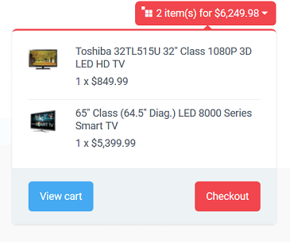

**************
Block Settings
**************

.. warning::

    This article may no longer be relevant or up to date. Please :doc:`return to the main page of the section. <index>`

Blocks can have the following specific settings:

.. _display_bottom_buttons:

Display bottom buttons
**********************

Select to display **View cart** and **Checkout** buttons in the mini-cart.

.. _display_delete_icons:

Display delete icons
********************

Select to display the **Delete** icon in the mini-cart.

.. _do_not_scroll_automatically:

Do not scroll automatically
***************************

Select to disable automatic items scrolling (items will scroll only when clicking arrows).

.. _displayed_vendors:

Displayed vendors
*****************

Number of vendors to be displayed in the block.

.. note ::

	This setting is available only for Multi-Vendor.

.. _feed_description:

Feed description
****************

Description of the RSS feed.

.. _feed_title:

Feed title
**********

Title of the RSS feed.

.. _format:

Format
******

Format to display items - text titles or icons.

.. _hide_add_to_cart_button:

Hide add to cart button
***********************

If selected, the **Add to cart** button does not appear in the block.

.. _item_quantity:

Item quantity
*************

Number of items displaying in the block at the same time.

.. _limit:

Limit
*****

Maximum number of testimonials displayed in the block.

.. _minimal_items:

Minimal number if items to be placed in a dropdown list
*******************************************************

If the number of available items is equal or exceeds the number that you enter here, the selector is displayed as a drop-down list.

.. _number_of_items:

Number of items
***************

Number of items (products or pages) to be included in an RSS feed.

.. _pause_delay:

Pause delay (in seconds)
************************

Pause between items replacing each other in a scroller.

.. _products_links_type:

Products links type
*******************

Select whether to display (Thumbnail) or not (Text) a product thumbnail in the mini-cart.

.. _random:

Random
******

Select to display testimonials randomly. Otherwise, the latest testimonials will be displayed in the box.

.. _speed:

Speed
*****

The number that shows the scrolling speed: the bigger the number - the higher the speed.

.. _text:

Text
****

A short text to be displayed right to the selector. This can be something like *Select a language* or *Choose a currency*.
