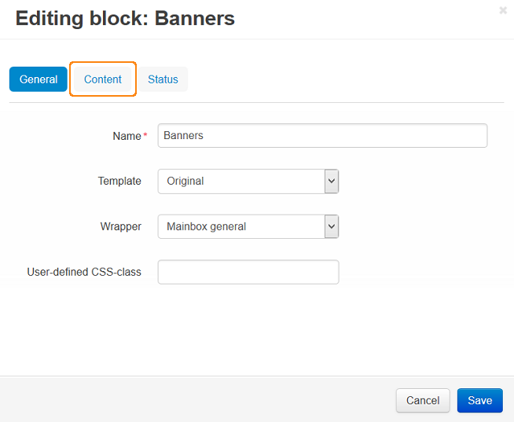

**************************************************************
How To: Display Different Banners for Different Category Pages
**************************************************************

To display a specific banner for each category page:

*   Create all necessary banners for categories:

    *   In the Administration panel, go to **Marketing > Banners**.

	.. important::

		If there is no such section, make sure that the **Banners management** add-on has an *Active* status in the **Add-ons > Manage add-ons** section.

    *   Click the **+** button on the right. The opened page allows to create banners.
    *   In the **Name** input field type the name of the banner, in the **Type** select box select *Graphic banner* and upload the necessary image.
    *   Click the **Create** button.
    *   Repeat these actions to create banners for other categories.
*   Go to **Design > Layouts > Categories**.
*   Click the **+** button in the necessary container and click **Add block**.
*   Open the **Create New Block** tab and in the opened section click the **Banners** button.
*   In the opened section, specify the name of the new block (e.g. *Banners*) and and click the **Create** button. Click on the gear icon on the created block and select:

    *   *Original* in the **Template** select box.
    *   Desired wrapper in the **Wrapper** select box.
    *   Desired CSS-class in the **User-defined CSS-class** input field.
*   Open the **Content** tab and select *Manually* in the **Filling** select box.
*   Click the **Save** button.

*   Go to **Products > Categories** and select the desired category.
*   Open the **Layouts** tab on the category details page.
*   Make sure that the **Banners** block is active.
*   Click on the gear icon to see the block options and open the **Content** tab.
*   Click the **Add banners** button, select the desired banners, and click the **Add banners and close** button.
*   Click the **Save** button.

.. image:: img/banners_02.png
    :align: center
    :alt: Layouts

*   Repeat these points for other categories.

.. note::

	After the block is created or changed, make sure it is displayed correctly. Sometimes not all wrappers are suitable for the blocks.