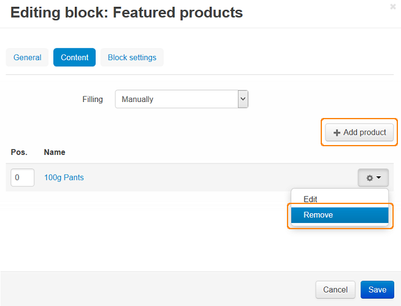

*****************
Featured Products
*****************

To create the **Featured products** section (if you do not have one) on the Homepage:

*   In the Administration panel, go to **Design → Layouts → Homepage**.
*   Click the **+** button in the necessary container and click **Add block**.
*   Open the **Create New Block** tab and in the opened section click the **Products** button.
*   In the opened section specify the name of the new block (e.g. *Featured products*) and select *Grid* in the **Template** select box. Click the **Create** button.
*   Click on the gear icon of the created block and do the following:

    *   Specify the desired CSS-class in the **User-defined CSS-class** input field.
    *   Select desirable template in the **Template** select box.
*   Click the **Save** button.

.. image:: img/featured_02.png
    :align: center
    :alt: Editing block

*   Open the **Content** tab and select *Manually* in the **Filling** select box.
*   Click the **Create** button.

To change the existing set of products or add new ones to the **Featured products** section on the Homepage:

*   Go to **Design → Layouts → Homepage**.
*   In the **Featured products** block open the **Content** tab and click **Add product**.
    In the opened window add the necessary products and click the **Add products** button.

*   To delete products from the list of featured products, in the **Content** tab click the gear button next to the product you want to delete and click **Remove**. Click **Save**.

.. note::

	After the block is created or changed, make sure it is displayed correctly. Sometimes not all wrappers are suitable for a specific block type.