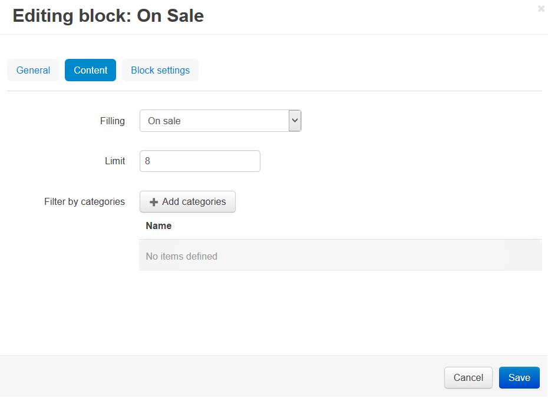

****************
On Sale Products
****************

To create the **On Sale** section (if you do not have one) on the Homepage:

*   In the Administration panel, go to **Design → Layouts → Homepage**.
*   Click the **+** button in the necessary container and click **Add block**.
*   Open the **Create New Block** tab and in the opened section click the **Products** button.
*   In the opened section specify the name of the new block (e.g. *On Sale*) and select *Grid* in the **Template** select box. Click the **Create** button.
*   Click on the gear icon of the created block and do the following:

    *   Specify the desired CSS-class in the **User-defined CSS-class** input field.
    *   Select desirable template in the **Template** select box.
*   Click the **Save** button.

*   Open the **Content** tab and select *On Sale* in the **Filling** select box.

*   Click the **Create** button.

.. note::

	After the block is created or changed, make sure it is displayed correctly. Sometimes not all wrappers are suitable for a specific block type.