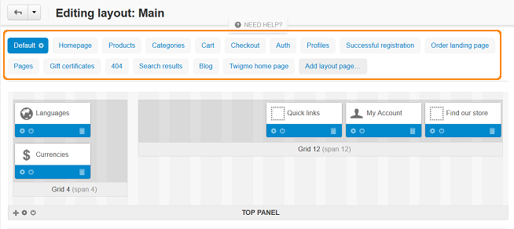

************************
How To: Hide Breadcrumbs
************************

To disable breadcrumbs in the storefront, do the following:

*   In the Administration panel, go to **Design → Layouts**.
*   Click the tab of the layout page, where you want to disable breadcrumbs. If the page is not in the layout pages list, click the **Default** layout page.

*   Click the **Activate/Deactivate Block** icon of the **Breadcrumbs** block.

.. image:: img/breadcrumbs_02.png
    :align: center
    :alt: Deactivate block

The block should become lighter:

.. image:: img/breadcrumbs_03.png
    :align: center
    :alt: Deactivated block

*   Repeat these steps for all layout pages where you want to disable breadcrumbs.